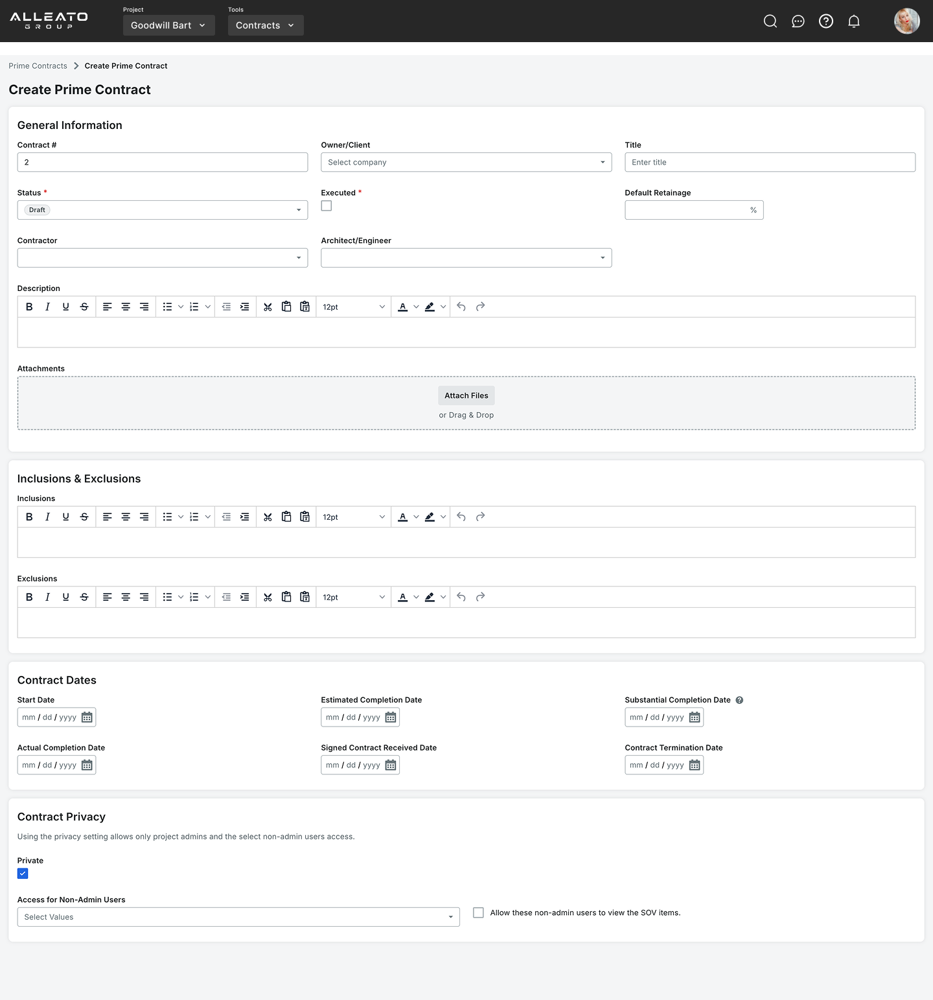
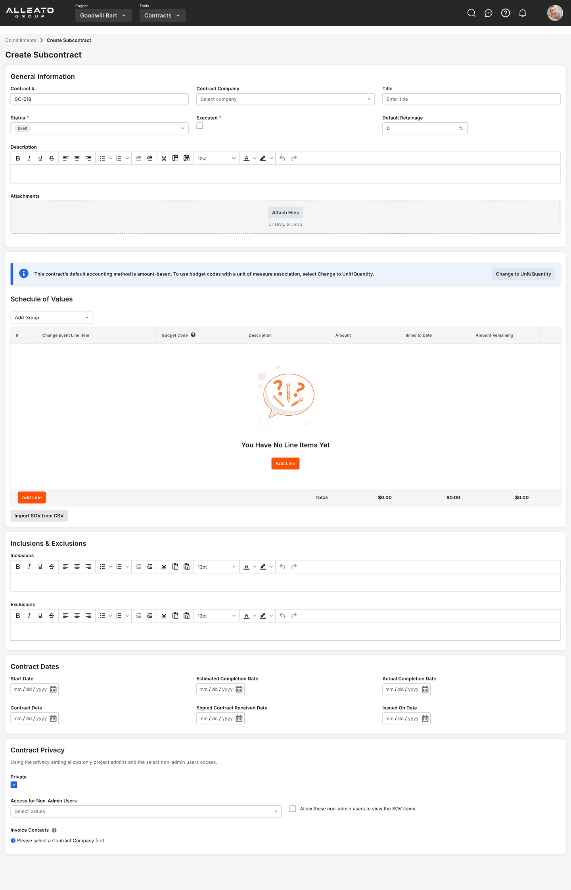

# Exec Plan - Procore Financial Suite

This ExecPlan is a living document and must be maintained in accordance with `.agents/PLANS.md`. The Current working tree and this file are the only context assumed for downstream contributors.

## Purpose / Big Picture

Codex CLI must translate the captured Procore financial UI (DOM, screenshots, crawl reports) into a faithful Supabase schema and implementation plan. Success means every financial workflow (budgets, contracts, change management, cost tracking, billing) can be implemented using the schema and guidance here, with page-to-entity traceability and instructions for deriving migrations, views, and UI/API layers.

## Progress

Use a list with checkboxes to summarize granular steps. Every stopping point must be documented here, even if it requires splitting a partially completed task into two ("done" vs. "remaining"). This section must always reflect the actual current state of the work.

## Phase Overview

| Phase | Name | Status | Timeline | Key Deliverables |
|-------|------|--------|----------|-----------------|
| **Phase 1** | Documentation & Analysis | ✅ 95% Complete | Current | Screenshots, DOM captures, sitemaps, field inventory, form implementations |
| **Phase 2** | Technical Analysis & Entity Modeling | ⏳ Not Started | 2 weeks | Data models, complexity analysis, entity relationships |
| **Phase 3** | MVP Definition & Schema Design | ⏳ Not Started | 3 weeks | Supabase schema, migrations, technical architecture |
| **Phase 4** | Implementation & Development | ⏳ Not Started | 16 weeks | Working modules, API endpoints, UI components |
| **Phase 5** | Validation & Deployment | ⏳ Not Started | 2 weeks | Deployed application, user training, metrics |
| **Phase 6** | Post-Launch & Maintenance | ⏳ Not Started | Ongoing | Updates, optimizations, feature iterations |

**Total Estimated Timeline**: 23 weeks (excluding Phase 6)

---

## Phase 1: Documentation & Analysis (Current - 95% Complete)

### Completed Tasks
- ✅ Captured planning brief, reviewed `.agents/PLANS.md`, `PROJECT-MANAGER-AGENT.md`, and `initiate_project.md`, and authored initial ExecPlan scaffold.(25-12-07 22:35Z) 
- ✅ (25-12-08 02:00Z) Built evidence inventory from `scripts/procore-screenshot-capture` outputs - created `planning/financial-entity-inventory.md`
- ✅ (25-12-08 02:10Z) Created and ran `analyze-procore-features.js` to extract features, fields, and patterns from DOM captures
- ✅ (25-12-08 02:15Z) Generated feature analysis reports: `module-summary.json`, `field-inventory.json`, `crud-operations.json`, `feature-analysis.md`
- ✅ (25-12-08 02:20Z) Generated complete database schema with `generate-data-models.js` - created SQL migrations, JSON schema, and ERD
- ✅ (25-12-08 02:22Z) Created 7 Supabase migration files (002-008) covering all financial modules including enums, tables, views
- ✅ (25-12-08 02:25Z) Created and ran `generate-seed-data.js` to produce comprehensive test data for all financial tables
- ✅ (25-12-08 02:29Z) Documented rollback procedures in `docs/migration-rollback-procedures.md` with step-by-step instructions
- ✅ (25-12-08 02:31Z) Created RLS policies in migration 009 and comprehensive security model in `docs/rls-security-model.md`
- ✅ (25-12-08 02:33Z) Created validation scripts `validate-migrations.js` and `test-migrations.sh` for testing schema integrity
- ✅ (25-12-08 18:45Z) Discovered existing frontend schema conflicts - reviewed `frontend/supabase/migrations/001_initial_schema.sql`
- ✅ (25-12-08 18:50Z) Created proper enhancement migrations: `002_financial_enhancements.sql` and `003_financial_views.sql` in frontend
- ✅ (25-12-08 18:55Z) Updated `frontend/supabase/seed.sql` with comprehensive test data for all tables
- ✅ (25-12-08 19:00Z) Removed duplicate migration files from scripts directory to avoid conflicts
- ✅ (25-12-08 19:15Z) Created table column analysis - documented all table columns by page in `table-columns-by-page.md`
- ✅ Set up development environment
- ✅ Install Playwright and dependencies  
- ✅ Create persistent login system (`scripts/setup-login.js`)
- ✅ Build screenshot crawler (`scripts/crawl-procore-simple.js`)
- ✅ Capture all major application pages
- ✅ Create application sitemap (`procore-sitemap.md`)
- ✅ Document module relationships
- ✅ Set up git repository
- ✅ Derive normalized Supabase schema (tables, enums, relationships, views) covering budgeting, contracts, change events/orders, cost tracking, billing/invoicing, and shared references.

### In Progress Tasks
- ✅ Deep-dive capture of modal dialogs (25-12-08 12:30Z)
  - ⚠️ RFI creation/edit modals - 404 error, page not accessible
  - ⚠️ Submittal workflows - 404 error, page not accessible
  - ⚠️ Change order forms - Could not find create button
  - ⚠️ Document upload dialogs - Could not trigger modal
  - ✅ Meeting creation modal captured
  - ⚠️ Punch item creation - Could not trigger modal
- [ ] Capture form validation rules
  - [ ] Required field indicators
  - [ ] Field format requirements
  - [ ] Conditional logic

## Forms
- ✅ New Project

- ✅ [Form - Prime Contract](https://us02.procore.com/webclients/host/companies/562949953443325/projects/562949954728542/tools/contracts/prime_contracts/create) (25-12-08 12:00Z) - Captured and implemented at `/contracts/new`

- ✅ [Form - Commitment - Subcontractor ](https://us02.procore.com/webclients/host/companies/562949953443325/projects/562949954728542/tools/contracts/commitments/work_order_contracts/create) (25-12-08 12:15Z) - Captured and implemented at `/commitments/subcontracts/new`

- ✅ [Form - Commitment - Purchase Order](https://us02.procore.com/webclients/host/companies/562949953443325/projects/562949954728542/tools/contracts/commitments/purchase_order_contracts/create) (25-12-08 12:20Z) - Captured and implemented at `/commitments/purchase-orders/new`

- [ ] Form - New Webhook
- [ ] Form - Budget Line Item
- [ ] Form - Budget Snapshot
- [ ] Form - Budget Modification

## Pages

### Financial
- ✅ Contracts http://localhost:3000/contracts (Tested 25-12-08)
- ✅ Commitments http://localhost:3000/commitments (Tested 25-12-08) - Updated with dropdown for creating Subcontracts and Purchase Orders
- ✅ Budget http://localhost:3000/budget (Tested 25-12-08)
- [ ] Change Orders
- [ ] Change Event
- [ ] Direct Cost
- [ ] Invoicing

### Form Pages Implemented
- ✅ Prime Contract Form `/contracts/new` (25-12-08)
- ✅ Subcontract Form `/commitments/subcontracts/new` (25-12-08)
- ✅ Purchase Order Form `/commitments/purchase-orders/new` (25-12-08)

### Project Management
- ✅ Projects/Home: 
- [ ] RFIs
- [ ] Submittals
- [ ] Transmittals
- [ ] Punch List
- [ ] Meetings - http://localhost:3000/meetings
- [ ] Schedule
- [ ] Daily Log
- [ ] Photos
- [ ] Drawings
- [ ] Emails

### Core Tools
- [ ] Company Directory
- [ ] Tasks
- [ ] Documents
- [ ] Admin
- [ ] Client Directory
- [ ] Chat

### 🎨 UI Improvements (Current Sprint)
- ✅ Portfolio page UI refinements (25-12-08 18:30Z) - Completed all UI improvements
  - ✅ Remove filter buttons (All/Active/Inactive) from Portfolio page
  - ✅ Move action button to same row as tabs, aligned to far right
  - ✅ Remove right column and make main content full width
  - ✅ Extend table to bottom of viewport with 50px padding

### ✅ Testing & Validation (25-12-08)
- ✅ (25-12-08 10:30Z) Created Playwright test script `tests/test-financial-pages.js` for automated page validation
- ✅ (25-12-08 10:35Z) Fixed Contracts page - was empty, created proper React component with summary cards
- ✅ (25-12-08 10:40Z) Updated Commitments page error handling for better UX when API fails
- ✅ (25-12-08 10:45Z) All 5 financial pages tested and passing in Playwright:
  - ✅ Portfolio/Home page loads correctly
  - ✅ Budget page renders without errors
  - ✅ Commitments page handles API errors gracefully
  - ✅ Contracts page displays properly
  - ✅ New Commitment form page works correctly

### Pending Tasks (Remaining 5%)
- [ ] Complete form validation capture
  - [ ] Required field indicators from implemented forms
  - [ ] Field format requirements
  - [ ] Conditional logic documentation
- [ ] Extract workflow states from captured forms
  - [ ] Document status transitions
  - [ ] Basic permission requirements from UI
- [ ] Final documentation updates
  - [ ] Complete Phase 1 summary report
  - [ ] Update progress metrics
  - [ ] Prepare Phase 2 transition plan

## Phase 2: Technical Analysis & Entity Modeling

### 🤖 Feature Extraction Automation
- ✅ Create `analyze-procore-features.js`
  - ✅ Parse all captured DOM files
  - ✅ Extract all form elements and fields
  - ✅ Identify CRUD operations per module
  - ✅ Map field validations
  - ✅ Export to structured JSON

- ✅ Create `generate-data-models.js`
  - ✅ Analyze field relationships
  - ✅ Generate entity relationship diagrams
  - ✅ Create database schema proposals
  - ✅ Document foreign key relationships
  - ✅ Identify many-to-many relationships

- [ ] Create `extract-workflows.js`
  - [ ] Map status transitions
  - [ ] Document approval chains
  - [ ] Extract business rules
  - [ ] Identify automation opportunities

- [ ] Create `analyze-permissions.js`
  - [ ] Extract role mentions from UI
  - [ ] Map permission matrices
  - [ ] Document access control patterns
  - [ ] Create RBAC specification

### 📊 Complexity Analysis
- [ ] Create `estimate-complexity.js`
  - [ ] Score each module (1-10 complexity)
  - [ ] Estimate development hours
  - [ ] Identify technical risks
  - [ ] Flag integration requirements

- [ ] Generate complexity report
  - [ ] Module-by-module breakdown
  - [ ] Total effort estimation
  - [ ] Risk assessment
  - [ ] Dependency mapping

### 🔍 UI/UX Analysis  
- [ ] Extract design patterns
  - [ ] Common components inventory
  - [ ] Form patterns
  - [ ] Navigation patterns
  - [ ] Modal/dialog patterns

- [ ] Create component library spec
  - [ ] Required components list
  - [ ] Component variations
  - [ ] Responsive requirements
  - [ ] Accessibility considerations

### 📈 Data Analysis
- [ ] Estimate data volumes
  - [ ] Records per module
  - [ ] File storage requirements
  - [ ] Growth projections
  - [ ] Performance requirements

- [ ] Document data relationships
  - [ ] Primary entities
  - [ ] Relationship cardinality
  - [ ] Data integrity rules
  - [ ] Cascade behaviors

### 🏗️ Entity Modeling & Traceability
- [ ] Build entity matrix covering all financial modules
  - [ ] Budgeting entities
  - [ ] Contracting (Prime/Commitments) entities
  - [ ] Change management entities
  - [ ] Cost tracking entities
  - [ ] Billing & invoicing entities
- [ ] Define relationships, enumerations, and shared references
- [ ] Draft `planning/page-schema-traceability.md` mapping UI to entities
- [ ] Create `planning/financial-entity-inventory.md`

## Phase 3: MVP Definition & Schema Design

### 🏆 Core Feature Identification
- [ ] Analyze feature usage patterns
  - [ ] Survey potential users
  - [ ] Review Procore community forums
  - [ ] Identify most-used features
  - [ ] Document pain points

- [ ] Create feature priority matrix
  - [ ] Must-have (MVP)
  - [ ] Should-have (Phase 2)
  - [ ] Nice-to-have (Phase 3)
  - [ ] Won't implement

### 📦 Module Prioritization

**Tier 1: Essential Modules (MVP)**
- [ ] Project Home
  - [ ] Dashboard widgets
  - [ ] Weather integration
  - [ ] Activity feed
  - [ ] Quick stats

- [ ] Directory
  - [ ] Company management
  - [ ] Contact management
  - [ ] User permissions
  - [ ] Role assignments

- [ ] RFIs
  - [ ] Create/Edit RFIs
  - [ ] Response tracking
  - [ ] Status workflow
  - [ ] Email notifications

- [ ] Submittals
  - [ ] Submittal log
  - [ ] Approval workflow
  - [ ] Revision tracking
  - [ ] Package management

- [ ] Daily Log
  - [ ] Weather tracking
  - [ ] Manpower logs
  - [ ] Work performed
  - [ ] Site photos

**Tier 2: Financial Modules (Current Focus)**
- [ ] Budget tracking
  - [ ] Budget line items
  - [ ] Forecast tracking
  - [ ] Variance reporting
- [ ] Commitments/Contracts
  - [ ] Prime contracts
  - [ ] Subcontracts/POs
  - [ ] Contract line items
- [ ] Change orders
  - [ ] Change events
  - [ ] Change order creation
  - [ ] Approval workflows
- [ ] Cost tracking
  - [ ] Committed costs
  - [ ] Direct costs
  - [ ] Forecasting
- [ ] Billing & Invoicing
  - [ ] Billing periods
  - [ ] Invoice generation
  - [ ] Payment tracking

### 🏗️ Technical Architecture
- [ ] Select technology stack
  - [ ] Frontend framework (Next.js - Selected)
  - [ ] Backend framework (Supabase - Selected)
  - [ ] Database (PostgreSQL via Supabase - Selected)
  - [ ] File storage (Supabase Storage - Selected)
  - [ ] Authentication (Supabase Auth - Selected)

- [ ] Design system architecture
  - [ ] API structure (REST via Next.js routes)
  - [ ] Real-time requirements (Supabase Realtime)
  - [ ] Caching strategy
  - [ ] Search infrastructure

### 📝 Schema Design
- [ ] Design normalized Supabase tables per module
  - [ ] Core tables with audit fields
  - [ ] Project scoping (multi-tenant)
  - [ ] Soft delete support
- [ ] Define Supabase enums for statuses/types
- ✅ Draft derived/reporting views
  - ✅ budget_summary_view
  - ✅ commitment_summary_view
  - ✅ cost_tracking_view
  - ✅ project_financial_summary
  - ✅ invoice_summary_view
  - ✅ change_order_impact_view
  - ✅ daily_log_summary_view
  - ✅ cost_code_hierarchy_view
- ✅ Design indexes and constraints
- ✅ Plan RLS (Row Level Security) policies - Implemented in migration files

### Migration Planning
- ✅ Review existing schema in `frontend/supabase/migrations/001_initial_schema.sql`
  - Core financial tables already exist: companies, users, projects, commitments, invoices, budget_items, etc.
- ✅ Author enhancement migration files under `frontend/supabase/migrations`
  - ✅ `002_financial_enhancements.sql` - Missing features: cost codes hierarchy, direct costs, billing periods, daily logs, lien waivers
  - ✅ `003_financial_views.sql` - Comprehensive reporting views and helper functions
- ✅ Update seed data file - Enhanced `frontend/supabase/seed.sql` with test data for all tables
- ✅ Remove duplicate migrations from `scripts/procore-screenshot-capture/supabase/migrations/`

## Phase 4: Implementation & Development

### 🛠️ Development Setup
- [ ] Set up development environment
  - [ ] Version control setup
  - [ ] Development database
  - [ ] Local file storage
  - [ ] Development tools
  - [ ] Code standards

- [ ] Create project structure
  - [ ] Frontend scaffolding
  - [ ] Backend structure
  - [ ] Shared components
  - [ ] Testing framework
  - [ ] Documentation setup

### 📅 Sprint Planning

**Sprint 0: Foundation**
- [ ] Project setup
- [ ] CI/CD pipeline
- [ ] Authentication system
- [ ] Basic UI framework
- [ ] Database schema implementation

**Sprint 1-2: Directory Module**
- [ ] Company CRUD operations
- [ ] User management
- [ ] Permission system implementation
- [ ] Role management
- [ ] Import/export functionality

**Sprint 3-4: Financial Modules**
- [ ] Budget module implementation
- [ ] Commitments/Contracts module
- [ ] Change order workflows
- [ ] Cost tracking features
- [ ] Billing & invoicing system

**Sprint 5-6: Core Modules (4 weeks)**
- [ ] RFI module
- [ ] Submittals module
- [ ] Daily Log module
- [ ] Integration between modules

**Sprint 7-8: Testing & Polish (4 weeks)**
- [ ] Integration testing
- [ ] Performance optimization
- [ ] UI polish
- [ ] User documentation
- [ ] Deployment preparation

### 🧪 Testing Strategy
- [ ] Unit testing setup
  - [ ] Frontend tests (React Testing Library)
  - [ ] Backend tests (Jest)
  - [ ] Integration tests
  - [ ] E2E tests (Playwright)

- [ ] Quality assurance
  - [ ] Test case creation
  - [ ] Manual testing procedures
  - [ ] Performance testing
  - [ ] Security testing
  - [ ] User acceptance testing

## Phase 5: Validation & Deployment

### ✅ Validation Steps
- ✅ Run validation tests - Created `validate-migrations.js` and `test-migrations.sh`
- [ ] Run `npx supabase db reset` - migrations apply without errors
- [ ] Execute seed workflows end-to-end
  - [ ] Create project → budget → commitment
  - [ ] Generate change order → approve → update costs
  - [ ] Create invoice → process payment
- [ ] Query all derived views - verify calculations
- [ ] Test RLS policies - verify access control
- [ ] Performance benchmarks meet targets
- [ ] Security audit passes

### 🚢 Deployment Planning  
- [ ] Production infrastructure setup
  - [ ] Supabase project configuration
  - [ ] Vercel deployment setup
  - [ ] Environment variables
  - [ ] Domain configuration
  - [ ] SSL certificates

- [ ] Migration strategy
  - [ ] Data migration tools
  - [ ] Training materials creation
  - [ ] User onboarding flow
  - [ ] Rollout plan
  - [ ] Rollback procedures

## Phase 6: Post-Launch & Maintenance

### 🔧 Technical Debt Management
- [ ] Regular refactoring sprints
- [ ] Dependency updates
- [ ] Security patches
- [ ] Performance optimization
- [ ] Documentation updates

### 📈 Continuous Improvement
- [ ] User feedback collection
- [ ] Feature usage analytics
- [ ] Performance monitoring
- [ ] Error tracking setup
- [ ] Iteration planning

## Surprises & Discoveries

**Observation: Limited form captures in financial modules**
  
  **Evidence:** Most pages show table views without create/edit forms. Only 2 out of 18 DOM files contain forms; budget, commitments, and prime_contracts pages have no form elements captured.

**Observation: Table columns now fully documented across all pages**
  
  **Evidence:** Created comprehensive analysis in `table-columns-by-page.md` showing:
  - Portfolio page has 12 columns (Name, Project Number, Address, City, State, ZIP, Phone, Status, Stage, Type, Notes)
  - Budget page shows 5 financial columns (Calculation Method, Unit Qty, UOM, Unit Cost, Original Budget)
  - Daily Log contains 30+ columns for detailed tracking
  - Common patterns include sortable columns, status indicators, and attachment fields

  
**Observation: Heavy use of React-style class names indicates modern frontend architecture**
  
  **Evidence:** Classes like `StyledButton-core-12_25_2__sc-c5bhwh-3` found throughout DOM captures

**Observation: Missing critical financial modules in current captures**
  Evidence: No DOM/screenshots for billing, invoicing, or direct costs modules despite being listed in requirements

Update this section as schema research uncovers mismatched UI expectations, missing DOM evidence, or Supabase limitations.

---

## Decision Log

- Decision: Use Supabase SQL migrations in `scripts/procore-screenshot-capture/supabase/migrations` as the canonical source for schema evolution instead of ad-hoc SQL snippets to keep parity with capture tooling and future RAG workflows.
  Rationale: Aligns with existing capture project layout and keeps migrations replayable; Supabase can be provisioned locally or in the cloud with the same scripts.
  Date/Author: 25-12-07 / Codex PM

---

## Outcomes & Retrospective

_Fill once schema design & implementation planning completes; summarize achieved artifacts, unresolved risks, and recommended follow-ups._

---

## Context and Orientation

- Source evidence sits under `scripts/procore-screenshot-capture/` with key subfolders:
  - `outputs/dom/` – raw HTML snapshots per page.
  - `outputs/screenshots/` – viewport/full-page captures grouped by module.
  - `outputs/reports/` – generated Markdown tables (`sitemap-table.md`, `sitemap-list.md`) and JSON (`detailed-report.json`) describing URLs, link graphs, and detected components.

  - `complete-procore-sitemap.md`, `sitemap-overview.md`, and `procore-db-schema-notion.md` – curated documentation from previous crawls.

  - `scripts/` – automation (e.g., `fresh-crawl.js`, `analyze-dom.js`, `capture-with-supabase.ts`) capable of re-running capture or generating Supabase payloads.

- Supabase integration already exists in `scripts/procore-screenshot-capture/lib/supabase.ts` and `supabase/migrations/*.sql`. We will extend these migrations with the new financial schema.

- Financial modules to cover (per initiate_project.md): Budgeting, Contracting (Prime/Commitments), Change Management (Change Events → Change Orders), Cost Tracking (Committed & Direct Costs), Billing & Invoicing (Billing Periods + Invoices), plus metadata (projects, vendors, cost codes, contacts).

- The ExecPlan must anchor every schema element in observable UI evidence, not conjecture.

---

## Plan of Work

1. **Evidence Audit**
   - Use `npm run crawl:sitemap` (or `node fresh-crawl.js`) inside `scripts/procore-screenshot-capture` to regenerate reports if data is stale.
   - Parse `outputs/reports/sitemap-table.md` and `complete-procore-sitemap.md` to enumerate all finance-related URLs/forms listed in the brain dump; flag gaps compared to provided bullet list.
   - Pull representative DOM snapshots from `outputs/dom/<module>/<page>.html` and annotate each with observable fields, relationships, and enumerations (e.g., status dropdown options).
   - Reference screenshot folders to understand UI grouping, nested tables, and multi-entity flows.
2. **Entity Inventory & Traceability**
   - Build an entity matrix in a scratchpad (e.g., `planning/financial-entity-inventory.md`) listing: entity name, module, source page(s), key fields, relationships, derived values, evidence files.
   - For each listed UI page/form, map to underlying schema components. Example:
     - `Budget` page → `budgets`, `budget_line_items`, derived views such as `budget_summary`.
     - `Change Events` → `change_events`, `change_event_items`, `change_event_cost_impacts`.
   - Include cross-cutting references (`projects`, `cost_codes`, `vendors`, `users`, `attachments`).
3. **Schema Design (Supabase)**
   - Define normalized tables grouped by module with consistent naming (`financial_<domain>_<entity>` or similar), surrogate UUID primary keys, tenant scoping via `project_id`, audit columns (`created_at`, `updated_at`, `created_by`).
   - Encode enumerations as Supabase `enum` types (e.g., `contract_status`, `change_order_type`).
   - Specify foreign keys, cascading behaviors, and bridging tables for many-to-many relations (e.g., linking change orders to both prime contracts and commitments).
   - Capture derived/reporting views:
     - `budget_summary_view` (aggregating line items, pending COs, projected costs).
     - `committed_costs_view` (summing commitment items + change orders).
     - `forecast_variance_view`.
   - Document indexes and unique constraints required to enforce business rules (e.g., unique `cost_code` per project, sequential numbering per contract).
4. **Migration Authoring**
   - Extend `scripts/procore-screenshot-capture/supabase/migrations/` with versioned SQL files:
     - `002_financial_enums.sql` – create enums.
     - `003_financial_core_tables.sql` – budgets, cost codes, vendors, attachments.
     - `004_financial_contracts.sql` – prime/commitment contracts, items, approvals.
     - `005_financial_changes.sql` – change events/orders, mapping tables.
     - `006_financial_billing.sql` – billing periods, invoices, payments.
     - `007_financial_views.sql` – derived views, security definer functions if needed.
   - Include `supabase/config.toml` or CLI instructions for running migrations locally and in CI.
5. **Schema Validation & Sample Data**
   - Write seed scripts or SQL inserts demonstrating representative workflows (create budget → commitment → change order → invoice) to validate referential integrity.
   - Use Supabase CLI (`npx supabase db reset`) to rebuild schema and run smoke tests.
6. **Development Implementation Plan**
   - Back-end: Outline API modules (e.g., Next.js route handlers or Node services) referencing new tables, including required endpoints (list budgets, create change event, issue invoice) and validations.
   - Front-end: Map each UI page/form from the bullet list to deliverables (components under `frontend/app/(forms)/` and `frontend/app/(tables)/`). Provide accepted data shapes referencing schema tables.
   - Designer deliverables: specify expected outputs for layout/wireframe files under `/design`.
7. **Evidence-Driven Enhancements**
   - Review `scripts/procore-screenshot-capture/complete-procore-sitemap.md` vs actual UI evidence. If missing pages, add tasks to adjust capture scripts (e.g., modify `fresh-crawl.js` to include subroutes, add new Playwright selectors) and schedule reruns.
   - Document how to use the capture outputs as "source evidence" whenever schema assumptions need proof.

---

## Concrete Steps

1. **Regenerate or Verify Evidence**
   - `cd scripts/procore-screenshot-capture`
   - `npm install` (if needed)
   - `npm run crawl:sitemap`
   - Expected: Updated `outputs/reports/*.md` and DOM/screenshot folders for all financial pages.
2. **Index Financial Pages**
   - `rg -n "Financial" outputs/reports/sitemap-table.md` to locate relevant sections.
   - `node scripts/generate-consolidated-report.js --module financials` (if available) to extract JSON for programmatic analysis.
3. **Annotate DOM Evidence**
   - Use a lightweight parser (e.g., `node analyze-dom.js --input outputs/dom/financials/budget.html --pretty`) to list form fields.
   - Store annotations in `planning/financial-entity-inventory.md`.
4. **Design Schema Documents**
   - Draft schema narrative plus entity-relationship diagrams (textual) within `planning/financial-schema.md`.
   - Translate to SQL migrations under `supabase/migrations/00X_*.sql`, ensuring each file is idempotent.
5. **Validate Locally**
   - `cd scripts/procore-screenshot-capture`
   - `npx supabase db reset` (creates or refreshes local Postgres with migrations)
   - `npx supabase db seed` (if seeds prepared)
   - Use `psql` or Supabase Studio to query `budget_summary_view`, `committed_costs_view`, etc., verifying expected outputs.
6. **Plan Downstream Implementation**
   - Update `AGENT_TASKS.md` with deliverables for Designer/Frontend/Backend/Tester referencing schema artifacts.
   - Feed `pm_execute.py` once `REQUIREMENTS.md`, `TEST.md`, and `AGENT_TASKS.md` capture all instructions.

## Validation and Acceptance

- The schema must recreate every workflow depicted in the capture evidence. Acceptance requires:
  - Running Supabase migrations successfully (`npx supabase db reset`) without errors.
  - Sample scenarios executed via SQL:
    - Create project, budget, forecast, commitment, change event/order, billing period, invoice; ensure all referential links exist and derived views reflect the data.
  - Evidence cross-check: for each page/form in the Financial list, cite at least one DOM/screenshot file that explains derived schema fields.
  - Generate documentation mapping page → schema in `planning/page-schema-traceability.md`.
  - Run Codex multi-agent workflow (`pm_execute.py`) and confirm downstream agents can find all required planning artifacts without manual intervention (only after this planning phase completes).

## Idempotence and Recovery

- Supabase migrations should be versioned and repeatable. Use `supabase db reset` or `supabase migration up --dry-run` to verify idempotence.
- Capture scripts can be re-run safely; they overwrite `outputs/` with timestamped data. Keep previous runs in Git history if comparisons required.
- If schema changes mid-plan, update both migrations and documentation, record decisions in the Decision Log, and re-run validation steps.

## Artifacts and Notes

- `scripts/procore-screenshot-capture/outputs/reports/sitemap-table.md` – canonical list of captured pages with evidence links.
- `scripts/procore-screenshot-capture/complete-procore-sitemap.md` – cross-reference for missing routes.
- `planning/financial-entity-inventory.md` (to be created) – matrix of UI evidence → entities.
- `supabase/migrations/002-007_*.sql` – forthcoming migration files covering the financial domain.
- `planning/page-schema-traceability.md` – planned artifact mapping UI to tables/views.

## Interfaces and Dependencies

- **Supabase CLI** (`npx supabase`) – required for running migrations/seeds. Document necessary environment variables (`SUPABASE_URL`, `SUPABASE_SERVICE_KEY`) in `.env`.
- **Node/Playwright Capture Scripts** – `npm run crawl:sitemap`, `npm run capture:supabase`, `node analyze-dom.js`. These scripts depend on the `scripts/procore-screenshot-capture/package.json` toolchain.
- **Database Modules**:
  - `budgets`, `budget_line_items`, `cost_codes`, `vendors`, `contacts`, `attachments`.
  - `prime_contracts`, `prime_contract_line_items`, `commitments`, `commitment_items`.
  - `change_events`, `change_event_items`, `change_orders`, `change_order_impacts`.
  - `billing_periods`, `invoices`, `invoice_line_items`, `payments`.
  - Derived views: `budget_summary_view`, `committed_costs_view`, `forecast_variance_view`.
- **APIs/Services**: Future backend endpoints should expose CRUD for each module with validation consistent with Supabase constraints.
- **External Tools**: `codex mcp` server invoked via `npx -y codex mcp` for agent orchestration; ensure `.env` contains `OPENAI_API_KEY`.

---

_Revision history:_  
- 25-12-07: Initial ExecPlan authored by Codex PM based on initiate_project.md and `.agents/PLANS.md`.
