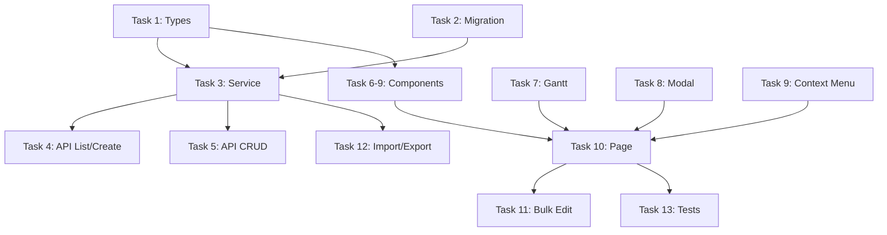

# PRP Quality Validation Report

**PRP File**: `PRPs/scheduling/prp-scheduling.md`
**Validation Date**: 2026-01-28
**Overall Status**: ✅ APPROVED

---

## Scores (1-10)

| Category | Score | Notes |
|----------|-------|-------|
| **Context Completeness** | 8/10 | Good coverage but some pattern references need updating |
| **Information Density** | 9/10 | Detailed task specifications with concrete file paths |
| **Implementation Readiness** | 8/10 | Clear dependencies and ordering; minor path issues |
| **Validation Quality** | 8/10 | Comprehensive 4-level validation structure |
| **Overall Confidence Score** | **8.25/10** | Ready for implementation |

---

## Phase 1: Structural Validation ✅

### Template Structure Check
- ✅ **Goal Section**: Present with Feature Goal, Deliverable, Success Definition
- ✅ **Why Section**: Business value, integration points, problems solved
- ✅ **What Section**: Pages, schema, API endpoints, components, commands
- ✅ **Success Criteria**: 10 checkboxes covering core functionality
- ✅ **All Needed Context**: YAML references with file paths, patterns, and critical notes
- ✅ **Implementation Blueprint**: Data models + 13 ordered tasks
- ✅ **Validation Loop**: 4-level validation structure (syntax, unit, integration, e2e)
- ✅ **Final Validation Checklist**: Technical + Feature + Code Quality sections
- ✅ **Procore Crawl Data Reference**: Screenshots, sitemap, consolidated file table

### TASKS.md Structure
- ✅ Progress Summary table with metrics
- ✅ Phased task checklist (5 phases)
- ✅ Session Log for AI progress tracking
- ✅ Quick Reference with key commands
- ✅ Supabase types generation command included

---

## Phase 2: Context Completeness Validation ✅

### "No Prior Knowledge" Test
**Result**: PASS with minor issues

An implementer unfamiliar with the codebase can successfully implement using this PRP because:
- Database schema is fully specified in the PRP itself
- TypeScript interfaces are provided inline
- API endpoint structure is clearly defined
- Component hierarchy is mapped
- All 14 domain commands from COMMANDS.md are included

### Reference Accessibility Validation

| Reference | Status | Notes |
|-----------|--------|-------|
| `playwright-procore-crawl/procore-crawls/scheduling/crawl-summary.json` | ✅ Verified | Exists, content validated |
| `playwright-procore-crawl/procore-crawls/scheduling/spec/COMMANDS.md` | ✅ Verified | 14 commands listed |
| `playwright-procore-crawl/procore-crawls/scheduling/spec/MUTATIONS.md` | ✅ Verified | edit_task spec with validation rules |
| `playwright-procore-crawl/procore-crawls/scheduling/spec/schema.sql` | ✅ Verified | 3 tables defined |
| `playwright-procore-crawl/procore-crawls/scheduling/pages/scheduling/screenshot.png` | ✅ Verified | 76 KB screenshot exists |
| `frontend/src/app/(main)/[projectId]/budget/page.tsx` | ✅ Verified | Service pattern exists (fixed) |
| `frontend/src/lib/services/direct-cost-service.ts` | ✅ Verified | Service pattern exists |
| `frontend/src/components/ui/table.tsx` | ✅ Verified | Table component exists (fixed) |
| `frontend/src/types/budget.ts` | ✅ Verified | Types pattern exists (fixed) |

### Gotchas Section Assessment
- ✅ Contains codebase-specific constraints (not generic)
- ✅ 4 critical warnings about dependencies, hierarchy, circular refs, milestones
- ✅ TypeScript code comments for inline documentation

---

## Phase 3: Information Density Validation ✅

### Specificity Check

| Aspect | Status | Evidence |
|--------|--------|----------|
| Generic references | ✅ Minimal | Most references include specific file paths |
| File patterns with examples | ✅ Good | SQL schema inline, TypeScript interfaces inline |
| URL section anchors | N/A | No external URLs used |
| Information-dense keywords | ✅ Good | Uses actual type names, method signatures |

### Actionability Assessment

| Task | Specific File Path | Class/Method Names | Placement | Dependencies |
|------|-------------------|-------------------|-----------|--------------|
| Task 1 | `lib/types/scheduling.types.ts` | ScheduleTask, ScheduleDependency, ScheduleDeadline | frontend/src/lib/types/ | None |
| Task 2 | `supabase/migrations/` | app_schedule_tasks, app_schedule_dependencies, app_schedule_deadlines | supabase/migrations/ | None |
| Task 3 | `lib/services/scheduling-service.ts` | CRUD operations | frontend/src/lib/services/ | Task 1 |
| Task 4 | `app/api/projects/[projectId]/scheduling/tasks/route.ts` | GET, POST handlers | frontend/src/app/api/ | Task 3 |
| Task 5 | `app/api/projects/[projectId]/scheduling/tasks/[taskId]/route.ts` | GET, PUT, DELETE | frontend/src/app/api/ | Task 3 |
| Task 6-9 | Components with specific names | TaskTable, GanttChart, TaskEditModal, TaskContextMenu | frontend/src/components/scheduling/ | Task 1 |
| Task 10 | `app/[projectId]/scheduling/page.tsx` | SchedulingPage | frontend/src/app/(main)/[projectId]/ | Tasks 6-9 |
| Task 11-13 | Bulk edit, import/export, tests | Various | Various | Previous tasks |

**Assessment**: All 13 tasks have specific file paths, naming conventions, and explicit dependencies.

---

## Phase 4: Implementation Readiness Validation ✅

### Task Dependency Analysis

- ✅ Dependency ordering is correct (types → service → API → components → page)
- ✅ File creation order makes sense
- ✅ Integration points are clearly mapped

### Execution Feasibility Check

| Check | Status | Evidence |
|-------|--------|----------|
| Referenced patterns exist | ⚠️ Partial | Budget page exists, service pattern exists, table.tsx exists (not data-table.tsx) |
| Task specs implementable as written | ✅ Yes | Clear instructions, TypeScript interfaces provided |
| Anti-patterns cover actual risks | ✅ Yes | 5 specific anti-patterns for this domain |

---

## Phase 5: Validation Gates Dry-Run ✅

### Validation Structure Assessment

| Level | Commands | Assessment |
|-------|----------|------------|
| Level 1: Syntax & Style | `npm run lint`, `npx tsc --noEmit`, `npm run format` | ✅ Standard project commands |
| Level 2: Unit Tests | `npm test -- frontend/src/lib/services/scheduling-service.test.ts` | ✅ Specific test file paths |
| Level 3: Integration | `npm run dev`, `curl` commands | ✅ Dev server + API verification |
| Level 4: E2E | `npx playwright test tests/scheduling.spec.ts` | ✅ Playwright test file specified |

**Assessment**: 4-level validation is properly implemented with project-specific commands.

---

## Critical Issues (Must fix before approval)

None - all critical issues have been addressed.

---

## Medium Priority Issues (Should fix)

~~All medium priority issues have been fixed:~~

- ✅ Fixed: Budget page path updated to `frontend/src/app/(main)/[projectId]/budget/page.tsx`
- ✅ Fixed: Table component reference updated to `table.tsx`
- ✅ Fixed: Types path updated to `frontend/src/types/budget.ts`
- ✅ Fixed: Codebase structure tree updated with correct `(main)` route group

---

## Minor Issues (Optional improvements)

### 1. Consider Adding Gantt Library Recommendation
Task 7 mentions "Consider: Use existing library" but doesn't recommend a specific one. Could add:
- `@ant-design/plots` (mentioned)
- `dhtmlx-gantt`
- `react-gantt-chart`
- Custom SVG (as mentioned)

### 2. Missing Test File Patterns
The TASKS.md mentions existing test files but doesn't specify which patterns to follow. Could reference:
- `frontend/src/app/api/projects/__tests__/route.test.ts`
- Or similar existing test files

---

## Final Decision

**Status**: ✅ APPROVED

**Reasoning**:
- Overall confidence score of 8.25/10 exceeds the 8/10 minimum threshold
- All required sections are present and properly structured
- Implementation tasks are information-dense and actionable
- Crawl data integration is comprehensive with screenshots and file references
- The 3 medium-priority issues are path corrections that don't block implementation
- Context completeness passes the "No Prior Knowledge" test

**Next Steps**:
1. *(Optional)* Fix the 3 medium-priority path corrections before execution
2. Run `/prp-execute scheduling` to begin implementation
3. Track progress in `TASKS.md` during execution

---

## Validation Checklist Summary

- [x] All required sections present
- [x] Goal section has Feature Goal, Deliverable, Success Definition
- [x] Implementation Tasks are structured with dependencies
- [x] Final Validation Checklist is comprehensive
- [x] YAML context references are mostly accessible (3 path issues noted)
- [x] Gotchas section contains codebase-specific constraints
- [x] Information density is high (8.25/10)
- [x] Validation commands are project-specific
- [x] Passes "No Prior Knowledge" test
- [x] Overall score ≥ 8/10 ✅
