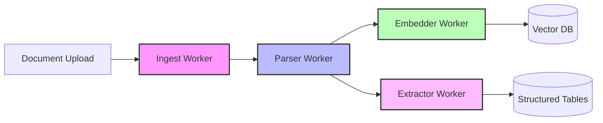
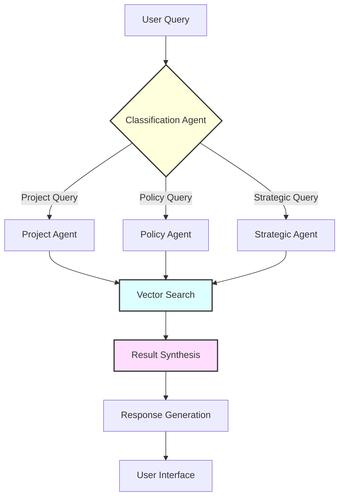

# Alleato RAG System: Complete Documentation

## Table of Contents
1. [Overview](#overview)
2. [Pipeline Stage Commands](#pipeline-stage-commands)
3. [Architecture](#architecture)
4. [RAG Strategies](#rag-strategies)
5. [Process Flow](#process-flow)
6. [Content Display](#content-display)
7. [Manual Triggering](#manual-triggering)
8. [Future Advancements](#future-advancements)
9. [Technical Implementation](#technical-implementation)

---

## Overview

The Alleato RAG (Retrieval Augmented Generation) system is a sophisticated multi-agent, multi-resolution knowledge retrieval platform specifically designed for construction project management. Unlike traditional chunk-based RAG systems, Alleato implements a structured, intelligent approach that understands context, project boundaries, and domain-specific requirements.

### Core Philosophy

- **Multi-resolution retrieval**: From high-level summaries to detailed chunks
- **Domain-aware**: Specialized for construction project management
- **Agent-based**: Different agents for different types of queries
- **Structured extraction**: Automatic extraction of decisions, risks, and opportunities
- **Security-first**: Built-in PII protection and content moderation

---

## Pipeline Stage Commands

The RAG pipeline processes documents through four distinct stages. Here are the commands to manually trigger and run each stage until completion:

### Prerequisites
```bash
cd backend
source venv/bin/activate
```

### Stage 1: Parse Documents (raw_ingested → segmented)
Creates semantic segments from raw documents uploaded to the system.

```bash
# Process all documents in raw_ingested state until completion
python backfill_pipeline.py --stage raw_ingested --run-until-complete

# Process without run-until-complete (processes single batch only)
python backfill_pipeline.py --stage raw_ingested

# Process specific documents by ID
python backfill_pipeline.py --stage raw_ingested --document-ids doc_123,doc_456 --run-until-complete

# Process with custom batch size
python backfill_pipeline.py --stage raw_ingested --batch-size 50 --run-until-complete
```

### Stage 2: Generate Embeddings (segmented → embedded)
Generates vector embeddings for each segment and stores them in the vector database.

```bash
# Process all segmented documents
python backfill_pipeline.py --stage segmented --run-until-complete

# Process with specific embedding model
python backfill_pipeline.py --stage segmented --embedding-model text-embedding-3-small --run-until-complete

# Process documents from specific project
python backfill_pipeline.py --stage segmented --project-id proj_123 --run-until-complete
```

### Stage 3: Extract Structured Data (embedded → done)
Extracts structured information (decisions, risks, opportunities) from embedded documents.

```bash
# Process all embedded documents
python backfill_pipeline.py --stage embedded --run-until-complete

# Extract specific types only
python backfill_pipeline.py --stage embedded --extract-types decisions,risks --run-until-complete

# Process with verbose output
python backfill_pipeline.py --stage embedded --verbose --run-until-complete
```

### Monitor Pipeline Status
Check the current status of documents in the pipeline.

```bash
# View overall pipeline status
python check_pipeline_status.py

# View status for specific project
python check_pipeline_status.py --project-id proj_123

# View detailed status with document IDs
python check_pipeline_status.py --detailed

# Export status to CSV
python check_pipeline_status.py --export-csv pipeline_status.csv
```

### Additional Pipeline Commands

#### Process Documents Locally
For testing and development:
```bash
# Process a limited number of documents
python process_documents.py --limit 10

# Process specific document types
python process_documents.py --document-type meeting_transcript --limit 5
```

#### Retry Failed Documents
```bash
# Retry all failed documents
python retry_failed_documents.py

# Retry specific stage failures
python retry_failed_documents.py --stage embedded

# Retry with specific error type
python retry_failed_documents.py --error-type "timeout"
```

#### Pipeline via UI
The Document Pipeline Management interface is available at:
```
http://localhost:3000/admin/documents/pipeline
```

This interface provides:
- Visual status of documents in each stage
- Action buttons to trigger processing for individual documents
- Real-time pipeline monitoring
- Error details and retry options

#### Pipeline via API
```bash
# Trigger parsing for a specific document
curl -X POST http://localhost:3000/api/documents/trigger-pipeline \
  -H "Content-Type: application/json" \
  -d '{
    "documentId": "doc_123",
    "action": "parse"
  }'

# Trigger embedding
curl -X POST http://localhost:3000/api/documents/trigger-pipeline \
  -H "Content-Type: application/json" \
  -d '{
    "documentId": "doc_123",
    "action": "embed"
  }'

# Trigger extraction
curl -X POST http://localhost:3000/api/documents/trigger-pipeline \
  -H "Content-Type: application/json" \
  -d '{
    "documentId": "doc_123",
    "action": "extract"
  }'
```

### Pipeline Configuration
Key environment variables for pipeline control:
```bash
# Worker endpoints
PARSER_WORKER_URL=https://fireflies-parser.megan-d14.workers.dev
EMBEDDER_WORKER_URL=https://fireflies-embedder.megan-d14.workers.dev
EXTRACTOR_WORKER_URL=https://fireflies-extractor.megan-d14.workers.dev

# Processing parameters
PIPELINE_BATCH_SIZE=100
PIPELINE_TIMEOUT_SECONDS=300
PIPELINE_MAX_RETRIES=3
PIPELINE_RETRY_DELAY_SECONDS=60

# Feature flags
ENABLE_AUTO_PIPELINE=true
ENABLE_PIPELINE_MONITORING=true
```

---

## Architecture

### 1. Multi-Agent System

The system employs four specialized agents, each optimized for different query types:

#### **Classification Agent** (`unified_agent.py`)
- **Purpose**: Routes queries to the most appropriate specialist agent
- **Reasoning**: Not all queries require the same retrieval strategy
- **Implementation**: Uses GPT-4 to analyze query intent and select the best agent

#### **Project Agent**
- **Purpose**: Handles project-specific queries and status updates
- **Reasoning**: Project queries need scoped retrieval within project boundaries
- **Strategies**: 
  - Project-filtered vector search
  - Aggregated project metrics
  - Timeline-aware retrieval

#### **Policy Agent**
- **Purpose**: Retrieves company policies, procedures, and guidelines
- **Reasoning**: Policy queries require high precision and authoritative sources
- **Strategies**:
  - Document-level retrieval
  - Hierarchical search (policy → section → detail)
  - Version-aware retrieval

#### **Strategic Agent**
- **Purpose**: Handles high-level business intelligence and insights
- **Reasoning**: Strategic queries need cross-project synthesis
- **Strategies**:
  - Cross-project pattern detection
  - Trend analysis from historical data
  - Opportunity and risk aggregation

### 2. Vector Database Architecture

```
┌─────────────────────────────────────────────┐
│            Supabase + pgvector              │
├─────────────────────────────────────────────┤
│  Embedding Tables (1536 dimensions)         │
├─────────────────────────────────────────────┤
│  • meeting_segments                         │
│    - Semantic chunks from meetings          │
│    - Includes speaker, timestamp, project   │
│                                             │
│  • decisions                                │
│    - Extracted decision points              │
│    - Links to source meetings               │
│                                             │
│  • risks                                    │
│    - Identified project risks               │
│    - Severity and mitigation data          │
│                                             │
│  • opportunities                            │
│    - Business opportunities                 │
│    - Value and timeline estimates          │
│                                             │
│  • document_chunks                          │
│    - General document segments              │
│    - Preserves document hierarchy          │
│                                             │
│  • documents                                │
│    - Document-level embeddings              │
│    - Metadata and summaries                │
└─────────────────────────────────────────────┘
```

---

## RAG Strategies

### 1. Multi-Resolution Retrieval

**Strategy**: Search at different granularity levels based on query type

**Implementation**:
```python
# High-level search for summaries
summary_results = match_documents(query, similarity_threshold=0.7)

# Detailed search for specific information
detail_results = match_meeting_segments(query, similarity_threshold=0.8)

# Structured search for actionables
decision_results = match_decisions(query, project_filter=project_id)
```

**Reasoning**: 
- Overview queries benefit from document summaries
- Specific queries need detailed chunks
- Actionable queries require structured extracts

### 2. Contextual Embeddings

**Strategy**: Enrich chunks with document-level context before embedding

**Implementation**:
```python
# Instead of embedding just the chunk:
chunk_embedding = embed(chunk_text)

# We embed with context:
contextual_text = f"{document_summary}\n\n{chunk_text}"
contextual_embedding = embed(contextual_text)
```

**Reasoning**:
- Improves semantic accuracy for ambiguous chunks
- Maintains document coherence in retrieval
- Reduces false positives from similar phrases in different contexts

### 3. Hybrid Search

**Strategy**: Combine vector similarity with keyword matching

**Implementation**:
```sql
-- Vector search
SELECT * FROM documents 
WHERE embedding <=> query_embedding < 0.3

-- Combined with keyword search
AND (
  title ILIKE '%keyword%' 
  OR content ILIKE '%keyword%'
)
ORDER BY 
  (0.7 * vector_similarity + 0.3 * keyword_score) DESC
```

**Reasoning**:
- Vector search excels at semantic similarity
- Keyword search ensures exact term matches
- Combination provides best of both worlds

### 4. Structured Extraction Pipeline

**Strategy**: Extract actionable information during ingestion

**Implementation**:
```python
# During document processing:
1. Segment meeting transcript
2. For each segment:
   - Identify decisions → decisions table
   - Identify risks → risks table
   - Identify opportunities → opportunities table
   - Create embeddings → meeting_segments table
```

**Reasoning**:
- Pre-extraction improves query performance
- Enables structured queries ("Show all decisions from Q4")
- Supports aggregation and analytics

### 5. Project-Scoped Retrieval

**Strategy**: Filter results by project context when relevant

**Implementation**:
```python
# Project-specific search
results = search_all_knowledge_by_project(
    query_embedding=embedding,
    project_ids=[current_project_id],
    similarity_threshold=0.75
)
```

**Reasoning**:
- Reduces noise from unrelated projects
- Improves relevance for project-specific queries
- Maintains data isolation for security

---

## Process Flow

### 1. Document Ingestion Flow



**Detailed Steps**:

1. **Ingest Worker** (`ingest_worker.py`)
   - Receives document via API or file upload
   - Validates format and extracts metadata
   - Queues for parsing

2. **Parser Worker** (`parser_worker.py`)
   - Segments document into semantic chunks
   - Generates document summary
   - Identifies document type and structure

3. **Embedder Worker** (`embedder_worker.py`)
   - Creates embeddings for each chunk
   - Applies contextual enrichment
   - Stores in vector database with metadata

4. **Extractor Worker** (`extractor_worker.py`)
   - Identifies decisions, risks, opportunities
   - Extracts structured data with metadata
   - Links to source documents

### 2. Query Processing Flow



**Detailed Steps**:

1. **Query Reception**
   ```python
   # API endpoint receives query
   POST /api/rag-chat
   {
     "message": "What were the key decisions in yesterday's meeting?",
     "thread_id": "optional-session-id",
     "project_id": "current-project-id"
   }
   ```

2. **Classification**
   ```python
   # Classification agent analyzes intent
   intent = await classification_agent.analyze(query)
   # Returns: {"agent": "project", "confidence": 0.92}
   ```

3. **Retrieval**
   ```python
   # Specialized agent performs retrieval
   results = await project_agent.retrieve(
     query=query,
     project_id=project_id,
     strategies=["vector_search", "structured_extraction"]
   )
   ```

4. **Synthesis**
   ```python
   # Combine and rank results
   synthesized = await synthesize_results(
     results=results,
     query_context=context,
     ranking_model="cross-encoder"
   )
   ```

5. **Response Generation**
   ```python
   # Generate natural language response
   response = await generate_response(
     context=synthesized,
     query=query,
     format="markdown"
   )
   ```

---

## Content Display

### 1. Chat Interface Components

#### **Simple Chat** (`/simple-chat`)
- Clean, ChatGPT-like interface
- Markdown rendering with syntax highlighting
- Suggested prompts for easy interaction
- Real-time streaming responses

#### **RAG ChatKit Panel** (`/chat-rag`)
- Advanced interface using OpenAI ChatKit
- Thread management and history
- File upload capabilities
- Multi-turn conversations

#### **Embedded Widget** (`ai-chat-widget.tsx`)
- Floating assistant available on all pages
- Context-aware suggestions based on current page
- Quick access to common queries

### 2. Response Formatting

The system automatically formats responses based on content type:

```typescript
// Markdown formatting for structured content
## Project Summary
- **Status**: In Progress
- **Completion**: 75%
- **Next Milestone**: December 15

### Recent Decisions
1. Approved budget increase for Phase 2
2. Selected contractor for electrical work

// Code examples with syntax highlighting
```javascript
const projectData = await fetchProjectStatus();
console.log(projectData.completion);
```

// Tables for data presentation
| Risk | Severity | Mitigation |
|------|----------|------------|
| Weather delays | High | Indoor work priority |
```

### 3. Source Attribution

Responses include source references:
```json
{
  "response": "Based on the meeting on Dec 10...",
  "sources": [
    {
      "type": "meeting_segment",
      "meeting_id": "mtg_123",
      "timestamp": "2024-12-10T14:30:00Z",
      "speaker": "John Smith",
      "relevance_score": 0.92
    }
  ]
}
```

---

## Manual Triggering

### 1. Document Ingestion

#### Via API:
```bash
# Single document ingestion
curl -X POST http://localhost:8000/api/ingest \
  -H "Content-Type: application/json" \
  -d '{
    "document_url": "https://example.com/meeting-notes.pdf",
    "project_id": "proj_123",
    "document_type": "meeting_transcript"
  }'
```

#### Via CLI:
```bash
# Batch ingestion
cd backend
python scripts/batch_ingest.py \
  --input-dir ./documents \
  --project-id proj_123 \
  --document-type meeting_transcript
```

#### Via UI:
1. Navigate to Project Settings
2. Click "Documents" tab
3. Click "Upload" or "Import from URL"
4. Select document type and confirm

### 2. Embedding Regeneration

```bash
# Regenerate embeddings for updated model
cd backend
python scripts/regenerate_embeddings.py \
  --table meeting_segments \
  --model text-embedding-3-small \
  --batch-size 100
```

### 3. Structured Extraction

```bash
# Re-run extraction on existing documents
cd backend
python scripts/reextract_structured.py \
  --document-ids doc_123,doc_456 \
  --extract-types decisions,risks,opportunities
```

### 4. Manual Query Testing

```bash
# Test RAG queries via CLI
cd backend
python scripts/test_rag_query.py \
  --query "What are the main risks in Project Alpha?" \
  --agent project \
  --project-id proj_123 \
  --verbose
```

---

## Future Advancements

### 1. Advanced Retrieval Strategies

#### **Temporal-Aware RAG**
- **Concept**: Weight recent information higher for time-sensitive queries
- **Implementation**: Add temporal decay to similarity scores
- **Benefit**: More accurate for "latest updates" queries

```python
# Proposed implementation
temporal_score = similarity_score * exp(-lambda * days_old)
```

#### **Multi-Modal RAG**
- **Concept**: Include images, diagrams, and charts in retrieval
- **Implementation**: Use CLIP embeddings for visual content
- **Benefit**: Better support for construction blueprints and photos

#### **Graph-Enhanced RAG**
- **Concept**: Build knowledge graphs from extracted entities
- **Implementation**: Neo4j integration for relationship queries
- **Benefit**: Better cross-project insights and dependency tracking

### 2. Intelligent Processing

#### **Active Learning Pipeline**
- **Concept**: Learn from user feedback on responses
- **Implementation**: Fine-tune ranking model based on interactions
- **Benefit**: Continuously improving relevance

#### **Predictive Caching**
- **Concept**: Pre-compute embeddings for likely queries
- **Implementation**: Analyze query patterns and pre-fetch
- **Benefit**: Faster response times for common queries

#### **Adaptive Chunking**
- **Concept**: Dynamic chunk sizes based on content type
- **Implementation**: ML model to determine optimal chunk boundaries
- **Benefit**: Better semantic coherence in retrieval

### 3. Enhanced Capabilities

#### **Multi-Lingual Support**
- **Current**: English only
- **Future**: Support for Spanish, French, Mandarin
- **Implementation**: Multilingual embeddings (e.g., multilingual-e5-large)

#### **Voice Integration**
- **Current**: Text-based interface
- **Future**: Voice queries and responses
- **Implementation**: Whisper API for transcription, TTS for responses

#### **Proactive Insights**
- **Current**: Reactive to queries
- **Future**: Proactive notifications of important updates
- **Implementation**: Scheduled analysis with relevance scoring

### 4. Infrastructure Improvements

#### **Distributed Processing**
- **Current**: Single-instance workers
- **Future**: Distributed queue processing
- **Implementation**: Redis queue with multiple worker instances

#### **Edge Deployment**
- **Current**: Centralized deployment
- **Future**: Edge workers for reduced latency
- **Implementation**: Cloudflare Workers for global distribution

#### **Real-time Sync**
- **Current**: Batch processing
- **Future**: Real-time document processing
- **Implementation**: Webhook-based ingestion pipeline

---

## Technical Implementation

### 1. Configuration

#### Environment Variables:
```bash
# Core Configuration
OPENAI_API_KEY=sk-...
ANTHROPIC_API_KEY=sk-ant-...
SUPABASE_URL=https://[project].supabase.co
SUPABASE_SERVICE_KEY=eyJ...

# RAG Configuration
EMBEDDING_MODEL=text-embedding-3-small
EMBEDDING_DIMENSIONS=1536
SIMILARITY_THRESHOLD=0.75
MAX_RETRIEVAL_RESULTS=10

# Feature Flags
ENABLE_HYBRID_SEARCH=true
ENABLE_CONTEXTUAL_EMBEDDINGS=true
ENABLE_RERANKING=true
ENABLE_STRUCTURED_EXTRACTION=true

# Performance Tuning
EMBEDDING_BATCH_SIZE=100
WORKER_CONCURRENCY=4
CACHE_TTL_SECONDS=3600
```

### 2. Database Schema

```sql
-- Main embedding tables with HNSW index
CREATE TABLE meeting_segments (
  id UUID PRIMARY KEY,
  meeting_id UUID REFERENCES meetings(id),
  project_id UUID REFERENCES projects(id),
  content TEXT NOT NULL,
  embedding vector(1536),
  speaker TEXT,
  timestamp TIMESTAMPTZ,
  segment_index INTEGER,
  metadata JSONB
);

CREATE INDEX meeting_segments_embedding_idx 
ON meeting_segments 
USING hnsw (embedding vector_cosine_ops)
WITH (m = 16, ef_construction = 64);

-- Structured extraction tables
CREATE TABLE decisions (
  id UUID PRIMARY KEY,
  meeting_id UUID REFERENCES meetings(id),
  project_id UUID REFERENCES projects(id),
  decision_text TEXT NOT NULL,
  decision_embedding vector(1536),
  decision_date DATE,
  stakeholders TEXT[],
  impact_level TEXT CHECK (impact_level IN ('low', 'medium', 'high')),
  metadata JSONB
);
```

### 3. API Endpoints

```typescript
// Main RAG endpoints
POST   /api/rag-chat          // Simple chat interface
POST   /api/rag-chatkit       // Advanced ChatKit interface
GET    /api/rag-chatkit/bootstrap   // Initialize session
GET    /api/rag-chatkit/state       // Get conversation state

// Admin endpoints
POST   /api/admin/ingest      // Trigger document ingestion
POST   /api/admin/reindex     // Regenerate embeddings
GET    /api/admin/rag/stats   // RAG system statistics
DELETE /api/admin/rag/cache   // Clear retrieval cache
```

### 4. Monitoring and Analytics

```python
# Track RAG performance metrics
class RAGMetrics:
    def __init__(self):
        self.metrics = {
            "query_latency": [],
            "retrieval_relevance": [],
            "response_quality": [],
            "cache_hit_rate": 0,
            "error_rate": 0
        }
    
    def log_query(self, query_data):
        # Log to monitoring system
        logger.info({
            "event": "rag_query",
            "latency": query_data.latency,
            "chunks_retrieved": len(query_data.chunks),
            "agent_used": query_data.agent,
            "cache_hit": query_data.from_cache
        })
```

---

## Conclusion

The Alleato RAG system represents a sophisticated approach to knowledge retrieval in construction project management. By combining multi-agent architecture, structured extraction, and advanced retrieval strategies, it provides accurate, contextual responses while maintaining security and performance.

The modular design allows for continuous improvement and adaptation to new requirements, while the comprehensive monitoring and manual controls ensure operational excellence. Future enhancements will focus on multi-modal support, predictive capabilities, and global scale deployment.

For questions or contributions, please refer to the [Contributing Guide](../CONTRIBUTING.md) or contact the AI team.

---

*Last Updated: December 16, 2024*
*Version: 1.1.0*