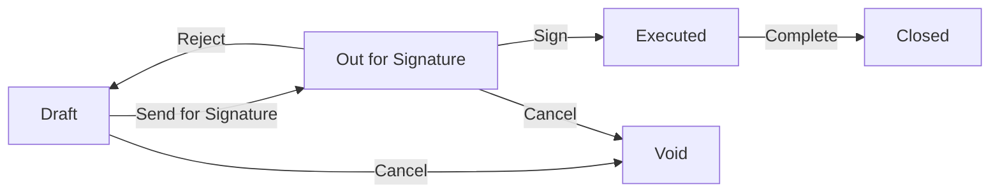
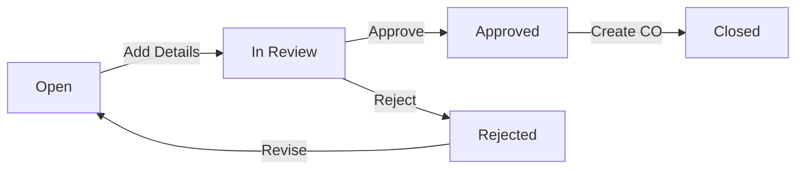
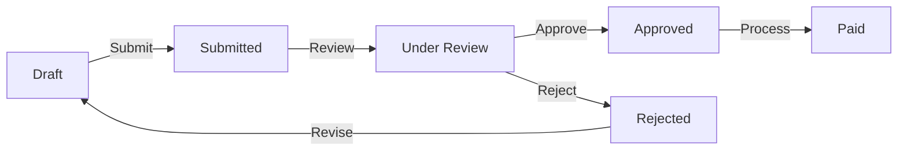

# Workflow Status Map

This document maps all status values and their transitions found in the UI components.

## Contract Statuses

### Prime Contracts & Commitments
Source: `/components/domain/contracts/ContractGeneralSection.tsx`

**Status Values:**
- `draft` - Initial state, editable
- `out_for_signature` - Sent for approval/signature
- `executed` - Signed and active
- `closed` - Completed/archived
- `void` - Cancelled

**Business Rules:**
- Only `draft` status allows full editing
- `executed` contracts cannot be deleted
- `closed` and `void` are terminal states

### Commitments (Subcontracts & Purchase Orders)
Source: `/app/(procore)/(financial)/commitments/page.tsx`

**Status Values:**
- `draft` - Initial creation state
- `sent` - Sent to vendor/subcontractor
- `pending` - Awaiting approval
- `approved` - Approved but not yet executed
- `executed` - Signed and active
- `closed` - Completed
- `void` - Cancelled

**Additional Statuses for Purchase Orders:**
- `pending_approval` - Internal approval needed
- `acknowledged` - Vendor acknowledged receipt
- `completed` - All items delivered

## Change Management Statuses

### Change Events
Inferred from typical workflow:

**Status Values:**
- `open` - Active change event
- `in_review` - Under evaluation
- `approved` - Approved for change order
- `rejected` - Not approved
- `closed` - Converted to change order

### Change Orders
Typical workflow states:

**Status Values:**
- `draft` - Being prepared
- `pending_approval` - Awaiting approval
- `approved` - Approved internally
- `sent` - Sent to owner/client
- `executed` - Signed by all parties
- `void` - Cancelled

## Invoice Statuses

Typical invoice workflow:

**Status Values:**
- `draft` - Being prepared
- `submitted` - Submitted for approval
- `under_review` - Being reviewed
- `approved` - Approved for payment
- `rejected` - Needs revision
- `paid` - Payment processed

## Project Statuses

Source: `/app/page.tsx`

**Status Values:**
- `Active` - Current project
- `Inactive` - Archived/completed project

**Stage Values:**
- `Current` - Active stage
- `Planning` - Pre-construction
- `Construction` - Active construction
- `Closeout` - Project completion
- `Warranty` - Post-completion

## Common Status Patterns

### Color Coding (StatusBadge)
- **Gray**: Draft, Inactive
- **Blue**: Sent, Submitted, In Review
- **Yellow/Orange**: Pending
- **Green**: Active, Approved, Executed
- **Dark Green**: Paid, Completed
- **Dark Gray**: Closed
- **Red**: Rejected, Void, Overdue

### Permission Rules by Status
1. **Draft States**: 
   - Full edit permissions
   - Can be deleted
   - Not visible to external parties

2. **Pending/Review States**:
   - Limited editing (comments only)
   - Cannot be deleted
   - Visible to approvers

3. **Executed/Active States**:
   - No editing of core fields
   - Change orders/amendments only
   - Cannot be deleted
   - Full visibility

4. **Terminal States** (Closed, Void, Paid):
   - Read-only
   - Cannot be modified
   - Archived but searchable

### Transition Guards
- Email notifications on status change
- Approval requirements for certain transitions
- Audit trail for all status changes
- Role-based permissions for transitions

## Daily Log & Operational Workflows

### Daily Log Entry Status
Typical states:
- `draft` - Being written
- `submitted` - Submitted for review
- `approved` - Approved by supervisor
- `archived` - Historical record

### Meeting Minutes Status
- `draft` - Being prepared
- `final` - Distributed to attendees

### RFI (Request for Information) Status
- `open` - Awaiting response
- `answered` - Response provided
- `closed` - Accepted/resolved

### Submittal Status
- `draft` - Being prepared
- `submitted` - Sent for review
- `approved` - Approved
- `approved_as_noted` - Approved with conditions
- `rejected` - Needs resubmission
- `closed` - Complete

## Bulk Status Operations

Common bulk operations:
- Approve multiple invoices
- Void multiple draft items
- Archive completed items
- Reopen closed items (with permission)

## Status Change Notifications

Typical notifications:
- Email on status change
- In-app notifications
- Dashboard alerts for pending items
- Daily/weekly status summaries

## Integration Points

Status changes often trigger:
- Accounting system updates
- Document generation
- Workflow automation
- Report updates
- Permission changes