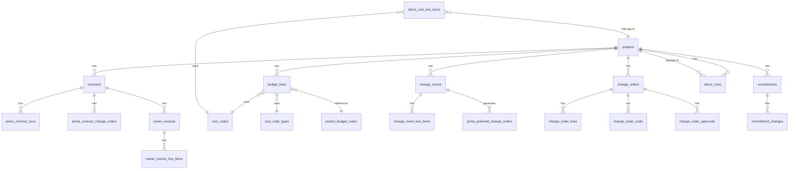

# Database Architecture: Financial Management System

## Table of Contents

1. [Overview](#overview)
2. [Entity Relationship Overview](#entity-relationship-overview)
3. [Core Financial Modules](#core-financial-modules)
   - [Budget Management](#1-budget-management)
   - [Prime Contracts](#2-prime-contracts)
   - [Commitments](#3-commitments)
   - [Change Events](#4-change-events)
   - [Change Orders](#5-change-orders)
   - [Direct Costs](#6-direct-costs)
   - [Owner Invoicing](#7-owner-invoicing)
4. [Supporting Tables](#supporting-tables)
5. [Data Flow Patterns](#data-flow-patterns)
6. [Business Logic & Workflows](#business-logic--workflows)

---

## Overview

The Alleato-Procore financial management system is built on a comprehensive PostgreSQL database that manages all aspects of construction project financials. The system tracks money flow from initial budgeting through prime contracts, commitments to subcontractors, change management, direct costs, and owner invoicing.

### Key Design Principles

- **Project-Centric**: All financial data is organized by `project_id`
- **Cost Code Based**: Financial tracking uses standardized cost codes and cost types
- **Audit Trail**: History tables maintain complete change logs
- **Status Tracking**: Most entities have status fields for workflow management
- **Temporal Data**: Created/updated timestamps on all tables

---

## Entity Relationship Overview



---

## Core Financial Modules

### 1. Budget Management

The budget system manages the project's financial baseline and tracks modifications over time.

#### Primary Tables

##### `budget_lines`

The core budget table that establishes financial baselines for each cost code.

**Purpose**: Stores individual budget line items that define how much money is allocated to specific cost codes and cost types.

**Key Columns**:
- `id` (string, UUID): Primary key
- `project_id` (number): Foreign key to projects
- `cost_code_id` (string): Foreign key to cost_codes
- `cost_type_id` (string): Foreign key to cost_code_types
- `project_budget_code_id` (string, nullable): Reference to project-specific budget code
- `original_amount` (number): The baseline budget amount
- `quantity` (number, nullable): Unit quantity for the budget line
- `unit_cost` (number, nullable): Cost per unit
- `unit_of_measure` (string, nullable): UOM (e.g., "SF", "LF", "EA")
- `description` (string, nullable): Line item description
- `sub_job_id` (string, nullable): Optional sub-job reference
- `sub_job_key` (string, nullable): Sub-job identifier
- `created_at` (timestamp): Creation timestamp
- `updated_at` (timestamp): Last update timestamp
- `created_by` (string, nullable): User who created the line
- `updated_by` (string, nullable): User who last updated

**Relationships**:
- `projects` → via `project_id`
- `cost_codes` → via `cost_code_id`
- `cost_code_types` → via `cost_type_id`
- `project_budget_codes` → via `project_budget_code_id`
- `sub_jobs` → via `sub_job_id`

---

##### `budget_modifications`

Tracks approved changes to the budget baseline.

**Purpose**: Documents formal budget change requests that adjust the project budget after initial approval.

**Key Columns**:
- `id` (string, UUID): Primary key
- `project_id` (number): Foreign key to projects
- `number` (string): Budget modification number (e.g., "BM-001")
- `title` (string): Descriptive title
- `status` (string): Workflow status (draft/pending/approved)
- `reason` (string, nullable): Justification for the modification
- `effective_date` (string, nullable): When the modification takes effect
- `created_at` (timestamp): Creation timestamp
- `updated_at` (timestamp): Last update timestamp
- `created_by` (string, nullable): User who created the modification

**Relationships**:
- `projects` → via `project_id`
- `budget_mod_lines` → one-to-many (detail lines)

---

##### `budget_mod_lines`

Detail lines for budget modifications.

**Purpose**: Individual line items that specify which budget lines are being modified and by how much.

**Key Columns**:
- `id` (string, UUID): Primary key
- `budget_modification_id` (string): Foreign key to budget_modifications
- `project_id` (number): Foreign key to projects
- `cost_code_id` (string): Foreign key to cost_codes
- `cost_type_id` (string): Foreign key to cost_code_types
- `amount` (number): The modification amount (positive or negative)
- `description` (string, nullable): Line item description
- `sub_job_id` (string, nullable): Optional sub-job reference
- `created_at` (timestamp): Creation timestamp
- `updated_at` (timestamp): Last update timestamp

**Relationships**:
- `budget_modifications` → via `budget_modification_id`
- `projects` → via `project_id`
- `cost_codes` → via `cost_code_id`
- `cost_code_types` → via `cost_type_id`
- `sub_jobs` → via `sub_job_id`

---

##### `budget_line_history`

Audit trail for budget line changes.

**Purpose**: Maintains a complete history of all changes made to budget lines for compliance and auditing.

**Key Columns**:
- `id` (string, UUID): Primary key
- `budget_line_id` (string): Foreign key to budget_lines
- `project_id` (number): Foreign key to projects
- `change_type` (string): Type of change (create/update/delete)
- `field_name` (string): Name of the field that changed
- `old_value` (string, nullable): Previous value
- `new_value` (string, nullable): New value
- `changed_at` (timestamp): When the change occurred
- `changed_by` (string, nullable): User who made the change
- `notes` (string, nullable): Additional context

**Relationships**:
- `budget_lines` → via `budget_line_id`
- `projects` → via `project_id`

---

##### `budget_line_item_history`

Alternative/supplementary history tracking for budget line items.

**Purpose**: Provides event-based history tracking with source information.

**Key Columns**:
- `id` (string, UUID): Primary key
- `budget_line_item_id` (string): Reference to budget line
- `project_id` (number): Foreign key to projects
- `budget_code` (string): The budget code affected
- `description` (string): Description of the event
- `event_type` (string): Type of event (create/update/delete)
- `changed_field` (string, nullable): Field that changed
- `from_value` (string, nullable): Previous value
- `to_value` (string, nullable): New value
- `source` (string): Source system or interface
- `performed_at` (timestamp): When the action occurred
- `performed_by` (string, nullable): User ID
- `performed_by_name` (string, nullable): User display name
- `notes` (string, nullable): Additional context

---

#### Budget Workflow

1. **Initial Budget Creation**
   - Budget lines are created in `budget_lines`
   - Each line references a `cost_code_id` and `cost_type_id`
   - `original_amount` establishes the baseline

2. **Budget Modifications**
   - Create a `budget_modifications` record with status "draft"
   - Add detail lines to `budget_mod_lines`
   - Approve the modification (status → "approved")
   - System recalculates affected `budget_lines`

3. **History Tracking**
   - All changes are logged to `budget_line_history`
   - Each change records old/new values and user attribution

---

### 2. Prime Contracts

Prime contracts represent agreements with the project owner and establish the revenue side of the project.

#### Primary Tables

##### `contracts`

Main contract record (note: this table serves both prime contracts and potentially other contract types).

**Purpose**: Stores the core contract information, financial totals, and execution status.

**Key Columns**:
- `id` (number): Primary key
- `project_id` (number): Foreign key to projects
- `client_id` (number): Foreign key to clients (the contracting party)
- `title` (string): Contract title
- `contract_number` (string, nullable): Contract identifier
- `original_contract_amount` (number, nullable): Initial contract value
- `revised_contract_amount` (number, nullable): Current contract value including approved change orders
- `approved_change_orders` (number, nullable): Total approved PCCOs
- `pending_change_orders` (number, nullable): Total pending PCCOs
- `draft_change_orders` (number, nullable): Total draft PCCOs
- `invoiced_amount` (number, nullable): Total amount invoiced to date
- `payments_received` (number, nullable): Total payments received
- `remaining_balance` (number, nullable): Unpaid balance
- `percent_paid` (number, nullable): Percentage of contract paid
- `retention_percentage` (number, nullable): Retainage percentage
- `default_retainage` (number, nullable): Default retainage for invoices
- `status` (string, nullable): Contract status
- `executed` (boolean, nullable): Whether contract is fully executed
- `start_date` (string, nullable): Contract start date
- `estimated_completion_date` (string, nullable): Planned completion
- `substantial_completion_date` (string, nullable): Substantial completion date
- `actual_completion_date` (string, nullable): Actual completion date
- `contractor_id` (number, nullable): Foreign key to contractor client
- `architect_engineer_id` (number, nullable): Foreign key to A&E client
- `owner_client_id` (number, nullable): Foreign key to owner client
- `description` (string, nullable): Contract description
- `inclusions` (string, nullable): Work included in contract
- `exclusions` (string, nullable): Work excluded from contract
- `notes` (string, nullable): Additional notes
- `apply_vertical_markup` (boolean, nullable): Whether to apply vertical markup
- `private` (boolean, nullable): Privacy flag
- `erp_status` (string, nullable): ERP integration status
- `attachment_count` (number, nullable): Number of attachments
- `signed_contract_received_date` (string, nullable): When signed contract was received
- `contract_termination_date` (string, nullable): If contract was terminated
- `created_at` (timestamp): Creation timestamp

**Relationships**:
- `projects` → via `project_id`
- `clients` → via `client_id`, `contractor_id`, `architect_engineer_id`, `owner_client_id`
- `prime_contract_sovs` → one-to-many
- `prime_contract_change_orders` → one-to-many
- `owner_invoices` → one-to-many

---

##### `prime_contract_sovs`

Schedule of Values (SOV) line items for prime contracts.

**Purpose**: Breaks down the contract into billable line items, forming the basis for progress invoicing.

**Key Columns**:
- `id` (number): Primary key
- `contract_id` (number): Foreign key to contracts
- `description` (string, nullable): Line item description
- `cost_code` (string, nullable): Associated cost code
- `quantity` (number, nullable): Line item quantity
- `unit_cost` (number, nullable): Cost per unit
- `uom` (string, nullable): Unit of measure
- `line_amount` (number, nullable): Total line amount (quantity × unit_cost)
- `sort_order` (number, nullable): Display order
- `created_at` (timestamp): Creation timestamp

**Relationships**:
- `contracts` → via `contract_id`

---

##### `prime_contract_change_orders`

Prime Contract Change Orders (PCCOs) that modify the contract value.

**Purpose**: Tracks approved changes to the prime contract that affect the revenue.

**Key Columns**:
- `id` (number): Primary key
- `contract_id` (number): Foreign key to contracts
- `title` (string): PCCO title
- `pcco_number` (string, nullable): PCCO identifier (e.g., "PCCO-001")
- `total_amount` (number, nullable): The dollar value of the change order
- `status` (string, nullable): Workflow status (draft/pending/approved)
- `submitted_at` (string, nullable): When PCCO was submitted
- `approved_at` (string, nullable): When PCCO was approved
- `executed` (boolean, nullable): Whether PCCO is fully executed
- `created_at` (timestamp): Creation timestamp

**Relationships**:
- `contracts` → via `contract_id`

---

##### `prime_potential_change_orders`

Prime Potential Change Orders (PCOs) that may become PCCOs.

**Purpose**: Tracks potential changes that are being negotiated with the owner before becoming approved change orders.

**Key Columns**:
- `id` (number): Primary key
- `project_id` (number): Foreign key to projects
- `contract_id` (number): Foreign key to contracts
- `change_event_id` (number, nullable): Foreign key to change_events
- `title` (string): PCO title
- `pco_number` (string, nullable): PCO identifier
- `scope` (string, nullable): Description of the work
- `reason` (string, nullable): Reason for the change
- `status` (string, nullable): Workflow status
- `notes` (string, nullable): Additional notes
- `submitted_at` (string, nullable): When PCO was submitted to owner
- `approved_at` (string, nullable): When PCO was approved
- `created_at` (timestamp): Creation timestamp

**Relationships**:
- `projects` → via `project_id`
- `contracts` → via `contract_id`
- `change_events` → via `change_event_id`

---

#### Prime Contract Workflow

1. **Contract Creation**
   - Create contract in `contracts` with `original_contract_amount`
   - Create SOV lines in `prime_contract_sovs`

2. **Progress Invoicing**
   - Create invoices against SOV lines (see Owner Invoicing section)
   - Track `invoiced_amount` and `payments_received`

3. **Change Management**
   - Identify change need (often from `change_events`)
   - Create `prime_potential_change_orders` (PCO)
   - Negotiate with owner
   - Upon approval, convert to `prime_contract_change_orders` (PCCO)
   - Update `revised_contract_amount` on contract

---

### 3. Commitments

Commitments represent subcontractor and vendor contracts that establish the cost side of the project.

#### Primary Tables

##### `commitments`

Core commitment/subcontract record.

**Purpose**: Tracks agreements with subcontractors and vendors for specific work packages.

**Key Columns**:
- `id` (string, UUID): Primary key
- `project_id` (number): Foreign key to projects
- `budget_item_id` (string): Links to a specific budget line
- `vendor_id` (string, nullable): Foreign key to vendor
- `contract_amount` (number): The committed contract value
- `retention_percentage` (number, nullable): Retainage held on payments
- `status` (string, nullable): Commitment status (draft/pending/executed)
- `executed_at` (string, nullable): When the commitment was executed
- `created_at` (timestamp): Creation timestamp

**Relationships**:
- `projects` → via `project_id`
- `budget_item_id` → references budget line (string reference, not explicit FK)
- `commitment_changes` → one-to-many

---

##### `commitment_changes`

Change orders against commitments.

**Purpose**: Tracks modifications to commitment values (subcontractor change orders).

**Key Columns**:
- `id` (string, UUID): Primary key
- `commitment_id` (string): Foreign key to commitments
- `budget_item_id` (string): Budget line affected
- `amount` (number): Change amount (positive or negative)
- `status` (string, nullable): Change order status
- `approved_at` (string, nullable): When approved
- `created_at` (timestamp): Creation timestamp

**Relationships**:
- `commitments` → via `commitment_id`

---

#### Commitment Workflow

1. **Commitment Creation**
   - Identify work scope and select vendor
   - Link to specific `budget_item_id`
   - Set `contract_amount` and `retention_percentage`
   - Status starts as "draft"

2. **Execution**
   - Review and approve
   - Set status to "executed"
   - Record `executed_at` timestamp

3. **Change Orders**
   - Create record in `commitment_changes`
   - Link to parent `commitment_id`
   - Upon approval, update commitment totals

---

### 4. Change Events

Change events are the starting point for managing scope changes on a project.

#### Primary Tables

##### `change_events`

Core change event record.

**Purpose**: Captures potential changes to project scope, acting as the source of truth for change management.

**Key Columns**:
- `id` (number): Primary key
- `project_id` (number): Foreign key to projects
- `title` (string): Change event title
- `event_number` (string, nullable): Change event identifier
- `scope` (string, nullable): Description of the scope change
- `reason` (string, nullable): Why the change is needed
- `status` (string, nullable): Workflow status (draft/pending/approved/rejected)
- `notes` (string, nullable): Additional notes
- `created_at` (timestamp): Creation timestamp

**Relationships**:
- `projects` → via `project_id`
- `change_event_line_items` → one-to-many
- `prime_potential_change_orders` → one-to-many (can spawn PCOs)

---

##### `change_event_line_items`

Cost estimates for change events.

**Purpose**: Provides rough order of magnitude (ROM) and final cost estimates for the change.

**Key Columns**:
- `id` (number): Primary key
- `change_event_id` (number): Foreign key to change_events
- `description` (string, nullable): Line item description
- `cost_code` (string, nullable): Associated cost code
- `quantity` (number, nullable): Estimated quantity
- `unit_cost` (number, nullable): Estimated unit cost
- `uom` (string, nullable): Unit of measure
- `rom_amount` (number, nullable): Rough order of magnitude estimate
- `final_amount` (number, nullable): Final negotiated amount
- `created_at` (timestamp): Creation timestamp

**Relationships**:
- `change_events` → via `change_event_id`

---

#### Change Event Workflow

1. **Event Identification**
   - Create `change_events` record with scope and reason
   - Add cost estimates in `change_event_line_items`
   - Use `rom_amount` for initial estimates

2. **Cost Refinement**
   - Review and refine estimates
   - Update `final_amount` when costs are firmed up

3. **Conversion to Change Orders**
   - If owner-facing: Create `prime_potential_change_orders`
   - If cost-facing: Create `change_orders` (internal change orders)
   - Link back to `change_event_id`

---

### 5. Change Orders

Change orders track approved budget modifications stemming from change events.

#### Primary Tables

##### `change_orders`

Main change order record.

**Purpose**: Documents approved changes to the project budget, typically linked to change events.

**Key Columns**:
- `id` (number): Primary key
- `project_id` (number): Foreign key to projects
- `title` (string, nullable): Change order title
- `co_number` (string, nullable): Change order number
- `description` (string, nullable): Detailed description
- `status` (string, nullable): Workflow status (draft/pending/approved)
- `submitted_at` (string, nullable): When submitted for approval
- `submitted_by` (string, nullable): Who submitted
- `approved_at` (string, nullable): When approved
- `approved_by` (string, nullable): Who approved
- `apply_vertical_markup` (boolean, nullable): Whether to apply markup
- `created_at` (timestamp): Creation timestamp
- `updated_at` (timestamp): Last update timestamp

**Relationships**:
- `projects` → via `project_id`
- `change_order_lines` → one-to-many
- `change_order_costs` → one-to-many
- `change_order_approvals` → one-to-many

---

##### `change_order_lines`

Budget line items affected by the change order.

**Purpose**: Specifies which budget lines are being modified and by how much.

**Key Columns**:
- `id` (string, UUID): Primary key
- `change_order_id` (number): Foreign key to change_orders
- `project_id` (number): Foreign key to projects
- `cost_code_id` (string): Foreign key to cost_codes
- `cost_type_id` (string): Foreign key to cost_code_types
- `amount` (number): The change amount
- `description` (string, nullable): Line item description
- `sub_job_id` (string, nullable): Optional sub-job reference
- `created_at` (timestamp): Creation timestamp
- `updated_at` (timestamp): Last update timestamp

**Relationships**:
- `change_orders` → via `change_order_id`
- `projects` → via `project_id`
- `cost_codes` → via `cost_code_id`
- `cost_code_types` → via `cost_type_id`
- `sub_jobs` → via `sub_job_id`

---

##### `change_order_costs`

Detailed cost breakdown for change orders.

**Purpose**: Provides granular cost tracking by category (labor, materials, subcontractor, etc.).

**Key Columns**:
- `id` (number): Primary key
- `change_order_id` (number): Foreign key to change_orders
- `labor` (number, nullable): Labor costs
- `materials` (number, nullable): Material costs
- `subcontractor` (number, nullable): Subcontractor costs
- `overhead` (number, nullable): Overhead costs
- `contingency` (number, nullable): Contingency amount
- `total_cost` (number, nullable): Sum of all cost components
- `updated_at` (timestamp): Last update timestamp

**Relationships**:
- `change_orders` → via `change_order_id`

---

##### `change_order_approvals`

Approval tracking for change orders.

**Purpose**: Records approval workflow steps and decisions.

**Key Columns**:
- `id` (number): Primary key
- `change_order_id` (number): Foreign key to change_orders
- `role` (string, nullable): Approver's role (PM, Owner, etc.)
- `approver` (string, nullable): User who approves
- `decision` (string, nullable): Approval decision (approved/rejected)
- `decided_at` (string, nullable): When decision was made
- `comment` (string, nullable): Approval comments

**Relationships**:
- `change_orders` → via `change_order_id`

---

#### Change Order Workflow

1. **Change Order Creation**
   - Create `change_orders` record (often from a `change_event`)
   - Status starts as "draft"

2. **Cost Analysis**
   - Add lines to `change_order_lines` (budget impacts)
   - Add detail to `change_order_costs` (cost breakdown)

3. **Approval Process**
   - Submit change order (status → "pending")
   - Create approval records in `change_order_approvals`
   - Collect approvals from required roles
   - Final approval sets status → "approved"

4. **Budget Impact**
   - Upon approval, system updates affected `budget_lines`
   - Change order amounts are applied to budget

---

### 6. Direct Costs

Direct costs capture expenses that don't go through commitments but are charged directly to the project.

#### Primary Tables

##### `direct_costs`

Main direct cost record.

**Purpose**: Tracks direct expenses like materials, equipment rentals, or small purchases charged to specific budget items.

**Key Columns**:
- `id` (string, UUID): Primary key
- `project_id` (number): Foreign key to projects
- `budget_item_id` (string): Budget line being charged
- `amount` (number): Cost amount
- `description` (string, nullable): Expense description
- `cost_type` (string, nullable): Type of cost (materials, equipment, etc.)
- `vendor_id` (string, nullable): Vendor who provided goods/services
- `incurred_date` (string, nullable): When cost was incurred
- `created_at` (timestamp): Creation timestamp

**Relationships**:
- `projects` → via `project_id`
- `budget_item_id` → references budget line (string reference)

---

##### `direct_cost_line_items`

Detailed line items for direct costs.

**Purpose**: Provides granular tracking of direct cost transactions with approval workflow.

**Key Columns**:
- `id` (string, UUID): Primary key
- `project_id` (number): Foreign key to projects
- `description` (string): Line item description
- `amount` (number): Line item amount
- `cost_code_id` (string, nullable): Foreign key to cost_codes
- `budget_code_id` (string, nullable): Budget code reference
- `cost_type` (string, nullable): Type of cost
- `vendor_name` (string, nullable): Vendor name
- `invoice_number` (string, nullable): Related invoice number
- `transaction_date` (string): When transaction occurred
- `approved` (boolean, nullable): Whether line item is approved
- `approved_by` (string, nullable): Who approved
- `approved_at` (string, nullable): When approved
- `created_by` (string, nullable): User who created
- `created_at` (timestamp): Creation timestamp
- `updated_at` (timestamp): Last update timestamp

**Relationships**:
- `projects` → via `project_id`
- `cost_codes` → via `cost_code_id`

---

#### Direct Cost Workflow

1. **Cost Entry**
   - Create `direct_costs` or `direct_cost_line_items` record
   - Link to `project_id` and `budget_item_id`/`cost_code_id`
   - Include vendor and invoice information

2. **Approval**
   - Review cost for validity
   - Set `approved` = true
   - Record `approved_by` and `approved_at`

3. **Budget Impact**
   - Approved direct costs reduce budget availability
   - Tracked in budget reports as actual costs

---

### 7. Owner Invoicing

Owner invoicing manages billing to the project owner against the prime contract.

#### Primary Tables

##### `owner_invoices`

Main invoice record.

**Purpose**: Represents a single invoice to the owner for work completed during a billing period.

**Key Columns**:
- `id` (number): Primary key
- `contract_id` (number): Foreign key to contracts
- `billing_period_id` (string, nullable): Foreign key to billing_periods
- `invoice_number` (string, nullable): Invoice identifier
- `period_start` (string, nullable): Billing period start date
- `period_end` (string, nullable): Billing period end date
- `status` (string, nullable): Invoice status (draft/pending/approved/paid)
- `submitted_at` (string, nullable): When invoice was submitted
- `approved_at` (string, nullable): When invoice was approved
- `created_at` (timestamp): Creation timestamp

**Relationships**:
- `contracts` → via `contract_id`
- `billing_periods` → via `billing_period_id`
- `owner_invoice_line_items` → one-to-many

---

##### `owner_invoice_line_items`

Line items on owner invoices.

**Purpose**: Individual charges on an invoice, typically based on SOV line items and percent complete.

**Key Columns**:
- `id` (number): Primary key
- `invoice_id` (number): Foreign key to owner_invoices
- `description` (string, nullable): Line item description
- `category` (string, nullable): Line item category
- `approved_amount` (number, nullable): Amount approved for payment
- `created_at` (timestamp): Creation timestamp

**Relationships**:
- `owner_invoices` → via `invoice_id`

---

#### Owner Invoicing Workflow

1. **Invoice Creation**
   - Create `owner_invoices` for a billing period
   - Link to `contract_id`
   - Set `period_start` and `period_end`

2. **Line Item Generation**
   - Based on `prime_contract_sovs`, determine percent complete
   - Create `owner_invoice_line_items` with amounts
   - Calculate retainage if applicable

3. **Submission and Approval**
   - Submit invoice (status → "pending")
   - Owner reviews and approves
   - Set `approved_at` and status → "approved"

4. **Payment Tracking**
   - When paid, status → "paid"
   - Update `invoiced_amount` and `payments_received` on contract

---

## Supporting Tables

### Cost Codes and Types

#### `cost_codes`

Standardized codes for categorizing work (e.g., CSI MasterFormat divisions).

**Key Columns**:
- `id` (string): Primary key (e.g., "03-3000")
- `division_id` (string): Foreign key to cost_code_divisions
- `title` (string, nullable): Code description (e.g., "Cast-in-Place Concrete")
- `division_title` (string, nullable): Division title
- `status` (string, nullable): Active/inactive
- `created_at`, `updated_at` (timestamps)

---

#### `cost_code_types`

Types of costs within a cost code (e.g., Labor, Materials, Equipment, Subcontractor).

**Key Columns**:
- `id` (string): Primary key
- `name` (string): Type name
- `description` (string, nullable): Type description

---

#### `project_budget_codes`

Project-specific cost code configurations.

**Purpose**: Allows customization of cost code descriptions and settings per project.

**Key Columns**:
- `id` (string, UUID): Primary key
- `project_id` (number): Foreign key to projects
- `cost_code_id` (string): Foreign key to cost_codes
- `cost_type_id` (string): Foreign key to cost_code_types
- `description` (string): Custom description for this project
- `description_mode` (string): How description is derived
- `is_active` (boolean): Whether code is active for this project
- `sub_job_id` (string, nullable): Optional sub-job reference
- `sub_job_key` (string, nullable): Sub-job identifier
- `created_at`, `updated_at` (timestamps)

---

### Clients and Vendors

#### `clients`

Companies involved in contracts (owners, architects, contractors).

Used by `contracts` table to identify contracting parties.

---

### Sub-Jobs

#### `sub_jobs`

Allows breaking down costs into smaller work packages or phases within a project.

Referenced by budget lines, change order lines, etc. via `sub_job_id`.

---

## Data Flow Patterns

### Budgeting to Cost Tracking

```
project_budget_codes
    ↓
budget_lines (original_amount)
    ↓ (modified by)
budget_modifications → budget_mod_lines
    ↓ (tracked in)
budget_line_history
```

### Revenue Flow (Owner Side)

```
contracts (original_contract_amount)
    ↓
prime_contract_sovs (breakdown)
    ↓
owner_invoices → owner_invoice_line_items
    ↓
payments_received (updated on contract)
```

### Cost Flow (Subcontractor Side)

```
commitments (contract_amount)
    ↓ (modified by)
commitment_changes
    ↓ (charges budget)
budget_lines
```

### Change Management Flow

```
change_events (identified change)
    ↓
change_event_line_items (cost estimates)
    ↓
prime_potential_change_orders (owner negotiation)
    ↓ (approved)
prime_contract_change_orders (revenue impact)
    AND/OR
change_orders → change_order_lines (budget impact)
```

### Direct Costs Flow

```
direct_costs OR direct_cost_line_items
    ↓
cost_codes
    ↓ (charges)
budget_lines
```

---

## Business Logic & Workflows

### Budget Lifecycle

1. **Setup**: Create `budget_lines` with `original_amount` for each cost code/type combination
2. **Baseline**: Lock in the approved budget
3. **Modifications**: Use `budget_modifications` to adjust baseline after approval
4. **Tracking**: Monitor actuals via commitments, direct costs, and change orders
5. **History**: All changes logged in `budget_line_history`

### Contract Lifecycle

1. **Creation**: Create `contracts` record with `original_contract_amount`
2. **SOV**: Define `prime_contract_sovs` line items
3. **Execution**: Mark contract as `executed`
4. **Billing**: Generate `owner_invoices` based on SOV progress
5. **Changes**: Track changes via `prime_contract_change_orders`
6. **Completion**: Mark substantial and actual completion dates

### Change Order Lifecycle

1. **Initiation**: Create `change_events` to identify scope changes
2. **Estimation**: Add `change_event_line_items` with ROM costs
3. **Owner Negotiation**: Create `prime_potential_change_orders` (PCOs)
4. **Approval**: Convert approved PCOs to `prime_contract_change_orders` (PCCOs)
5. **Budget Impact**: Create internal `change_orders` to adjust budget
6. **Execution**: Apply approved change order lines to `budget_lines`

### Commitment Lifecycle

1. **Bidding**: Identify work package and solicit bids
2. **Award**: Create `commitments` with `contract_amount`
3. **Execution**: Mark as `executed`
4. **Changes**: Track via `commitment_changes`
5. **Payment**: Process subcontractor invoices (handled in separate payment system)

### Direct Cost Lifecycle

1. **Incurrence**: Purchase materials or services
2. **Entry**: Create `direct_cost_line_items` with details
3. **Review**: Validate cost against invoice
4. **Approval**: Set `approved` flag and record approver
5. **Impact**: Cost reduces available budget in reports

### Invoice Lifecycle

1. **Period Close**: Determine billing period end
2. **Invoice Creation**: Create `owner_invoices` for the period
3. **Line Items**: Add `owner_invoice_line_items` based on SOV progress
4. **Review**: Internal review before submission
5. **Submission**: Mark as submitted to owner
6. **Approval**: Owner approves invoice
7. **Payment**: Receive payment and update contract totals

---

## Key Metrics and Calculations

### Budget Metrics

- **Original Budget**: Sum of `budget_lines.original_amount`
- **Revised Budget**: Original + sum of approved `budget_mod_lines.amount`
- **Committed Costs**: Sum of `commitments.contract_amount` + approved `commitment_changes.amount`
- **Actual Costs**: Sum of approved `direct_costs.amount` + `direct_cost_line_items.amount`
- **Budget Remaining**: Revised Budget - (Committed + Actual)
- **Forecasted Final Cost**: Committed + Actual + Estimated to Complete

### Contract Metrics

- **Original Contract Value**: `contracts.original_contract_amount`
- **Revised Contract Value**: Original + sum of approved `prime_contract_change_orders.total_amount`
- **Billed to Date**: Sum of approved `owner_invoices` amounts
- **Paid to Date**: `contracts.payments_received`
- **Remaining to Bill**: Revised Contract Value - Billed to Date
- **Retention Held**: Calculated based on `retention_percentage`

### Project Financial Health

- **Gross Margin**: Revised Contract Value - Forecasted Final Cost
- **Gross Margin %**: (Gross Margin / Revised Contract Value) × 100
- **Over/Under Budget**: Revised Budget - Forecasted Final Cost
- **Billing Efficiency**: Billed to Date / Percent Complete

---

## Database Design Considerations

### Normalization

- The schema is well-normalized with separate tables for headers and detail lines
- Foreign keys enforce referential integrity
- Many-to-many relationships are properly resolved through junction tables

### Audit and Compliance

- All major tables have `created_at` and `updated_at` timestamps
- History tables provide complete audit trails
- User attribution fields (`created_by`, `updated_by`, `approved_by`) track responsibility

### Performance

- All foreign keys should be indexed
- Frequently queried fields like `project_id`, `status`, `created_at` benefit from indexes
- Consider materialized views for complex financial rollups

### Data Integrity

- Use of UUIDs (strings) vs sequential integers (numbers) varies by table
- NULL-able fields allow for incomplete data during workflow stages
- Status fields enforce workflow states

---

## Extending the System

### Adding New Financial Modules

When adding new financial modules, follow these patterns:

1. **Header/Detail Pattern**: Create a header table (main record) and detail line table
2. **Project Relationship**: Always include `project_id` foreign key
3. **Status Tracking**: Include status field for workflow management
4. **Audit Fields**: Include `created_at`, `updated_at`, `created_by`, `updated_by`
5. **History Tables**: Consider creating corresponding history tables for audit trails
6. **Cost Code Links**: Link to `cost_codes` and `cost_code_types` where appropriate
7. **Amount Fields**: Use numeric types for all financial amounts

### Integration Points

- **ERP Systems**: `contracts.erp_status` field suggests ERP integration
- **Document Management**: `attachment_count` fields suggest document attachments
- **User Management**: User ID fields reference external user system
- **Reporting**: Financial reports query across multiple tables for comprehensive views

---

## Conclusion

The financial management database architecture provides a comprehensive, audit-friendly system for managing all aspects of construction project financials. The design supports:

- Complete budget lifecycle from planning through modifications
- Full contract management for both revenue (prime contracts) and costs (commitments)
- Robust change management workflow from events through approvals
- Direct cost tracking for non-committed expenses
- Progress invoicing and payment tracking
- Historical audit trails for compliance

The modular design allows each financial component to operate independently while maintaining data integrity through foreign key relationships and consistent patterns across all modules.

---

**Document Information**
- **File Path**: `/Users/meganharrison/Documents/github/alleato-procore/DATABASE_ARCHITECTURE.md`
- **Last Updated**: 2025-12-26
- **Source**: `/Users/meganharrison/Documents/github/alleato-procore/frontend/src/types/database.types.ts`
