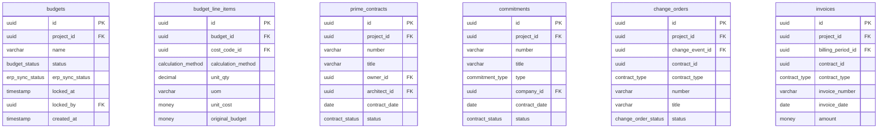

# Entity Relationship Diagram

Generated from Procore UI analysis

## Core Tables

## Financial Tables

## Relationships

- projects.company_id → companies.id (many-to-one)
- cost_codes.project_id → projects.id (many-to-one)
- cost_codes.parent_id → cost_codes.id (self-reference)
- budgets.project_id → projects.id (one-to-one)
- budget_line_items.budget_id → budgets.id (many-to-one)
- budget_line_items.cost_code_id → cost_codes.id (many-to-one)
- prime_contracts.project_id → projects.id (many-to-one)
- prime_contracts.owner_id → companies.id (many-to-one)
- prime_contracts.architect_id → companies.id (many-to-one)
- commitments.project_id → projects.id (many-to-one)
- commitments.company_id → companies.id (many-to-one)
- contract_line_items.cost_code_id → cost_codes.id (many-to-one)
- change_events.project_id → projects.id (many-to-one)
- change_orders.project_id → projects.id (many-to-one)
- change_orders.change_event_id → change_events.id (many-to-one)
- billing_periods.project_id → projects.id (many-to-one)
- invoices.project_id → projects.id (many-to-one)
- invoices.billing_period_id → billing_periods.id (many-to-one)
