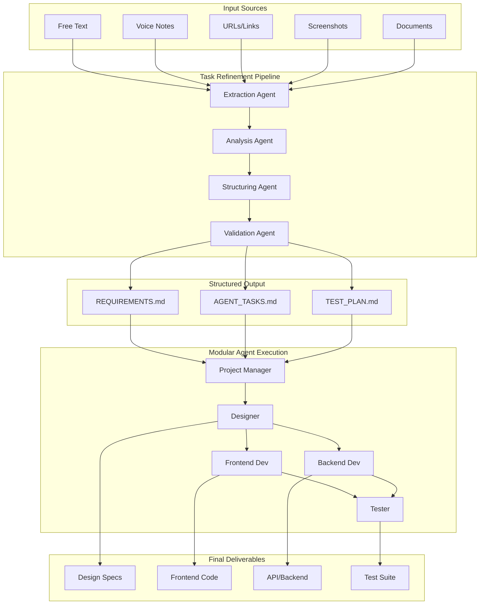

# Complete Architecture: Task Refinement + Modular Agents

## System Architecture



## Key Improvements Over Original Cookbook

| Aspect | Original Monolithic | Our Modular Solution |
|--------|-------------------|---------------------|
| **Timeout** | 100 hours (!) | 30 min per stage |
| **Input Quality** | Raw, unstructured | Refined, validated |
| **Failure Recovery** | Start over | Resume from any point |
| **Debugging** | Black box | Clear stage boundaries |
| **Parallelization** | Sequential only | Parallel execution |
| **Iteration Speed** | 11+ minutes minimum | 2-3 minutes per agent |

## Data Flow Example

```
1. INPUT: "I need commitments module like Procore for tablets"
           ↓
2. EXTRACTION: 
   - Goal: Commitments module
   - Reference: Procore
   - Constraint: Tablet support
           ↓
3. ANALYSIS:
   - Intent: Financial tracking
   - Users: Project managers
   - Platform: Mobile-first
           ↓
4. STRUCTURING:
   - 15 user stories
   - 8 technical requirements
   - 4 agent task lists
           ↓
5. VALIDATION:
   ✓ All sections present
   ✓ No ambiguities
   ✓ Quality score: 95%
           ↓
6. AGENT EXECUTION:
   → PM: Creates detailed specs
   → Designer: UI/UX mockups
   → Frontend: React components
   → Backend: API endpoints
   → Tester: Test scenarios
```

## Production Deployment Architecture

```
┌─────────────────┐     ┌─────────────────┐     ┌─────────────────┐
│   Web UI/CLI    │────▶│  Task Refiner   │────▶│  Task Queue     │
│                 │     │  (Container)    │     │  (Redis/SQS)    │
└─────────────────┘     └─────────────────┘     └────────┬────────┘
                                                         │
                              ┌──────────────────────────┴───────────┐
                              │                                      │
                         ┌────▼──────┐  ┌──────────┐  ┌─────────┐  │
                         │ PM Agent  │  │ Designer │  │Frontend │  │
                         │(Container)│  │(Container)│ │(Container)│ │
                         └───────────┘  └──────────┘  └─────────┘  │
                                                                    │
                         ┌───────────┐  ┌──────────┐               │
                         │ Backend   │  │ Tester   │               │
                         │(Container)│  │(Container)│───────────────┘
                         └───────────┘  └──────────┘
                                │
                         ┌──────▼─────────┐
                         │ Artifact Store │
                         │  (S3/GCS)      │
                         └────────────────┘
```

This architecture ensures your multi-agent system is production-ready, scalable, and maintainable!